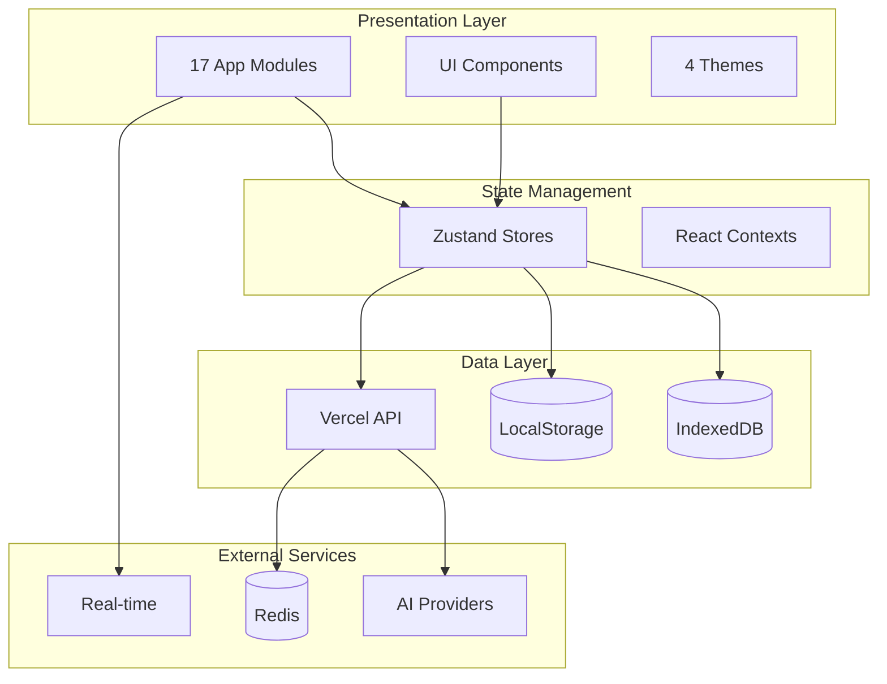
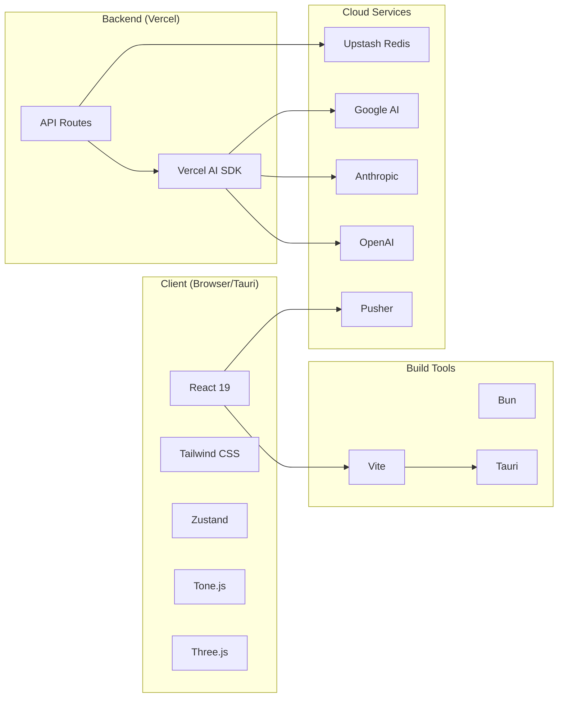

# Overview

ryOS is a modern web-based desktop environment inspired by classic macOS and Windows, built with React, TypeScript, and AI.



## Tech Stack

| Category | Technologies |
|----------|-------------|
| Frontend | React 19, TypeScript, Tailwind CSS, shadcn/ui, Framer Motion |
| State | Zustand with localStorage/IndexedDB persistence |
| Audio | Tone.js, WaveSurfer.js, Web Audio API |
| 3D | Three.js (shaders) |
| Text Editor | TipTap |
| Storage | IndexedDB, LocalStorage, Redis (Upstash) |
| AI | OpenAI, Anthropic, Google via Vercel AI SDK |
| Real-time | Pusher |
| Build | Vite, Bun |
| Desktop | Tauri (macOS, Windows, Linux) |
| Deployment | Vercel |



## Project Structure

```
├── api/              # Vercel API endpoints
├── public/           # Static assets
├── src/
│   ├── apps/         # 17 app modules
│   ├── components/   # Shared React components
│   ├── config/       # App registry
│   ├── contexts/     # React contexts
│   ├── hooks/        # 29 custom hooks
│   ├── lib/          # Libraries
│   ├── stores/       # 21 Zustand stores
│   ├── styles/       # CSS
│   ├── themes/       # 4 theme definitions
│   └── types/        # TypeScript types
├── src-tauri/        # Desktop app config
└── scripts/          # Build scripts
```

## Key Features

- **Multi-Theme Support:** System 7, Mac OS X (Aqua), Windows XP, Windows 98
- **17 Built-in Apps:** Finder, TextEdit, Paint, iPod, Terminal, Chats, and more
- **AI Assistant (Ryo):** Chat, tool calling, app control, code generation
- **Virtual File System:** IndexedDB-backed with lazy loading
- **Real-time Chat:** Pusher-powered rooms with AI integration
- **PWA Support:** Offline-capable with service worker caching
- **Desktop App:** Tauri-based native app
