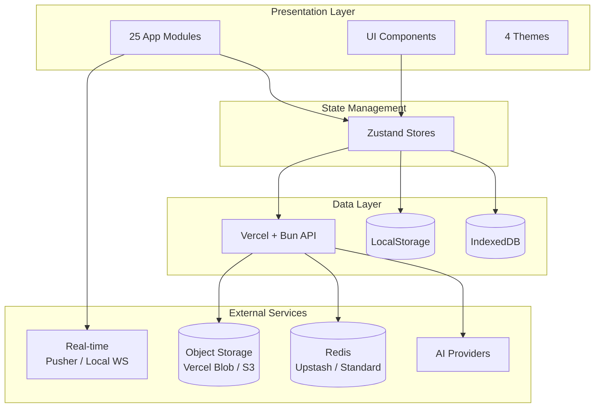

# Overview

ryOS is a web-based desktop environment that brings the nostalgia of classic operating systems to modern browsers. Experience the charm of Mac OS X Aqua, System 7, Windows XP, and Windows 98—all running in your browser with 25 fully-functional apps, an AI assistant, and a complete virtual file system.

Whether you're exploring the retro aesthetics, building HTML applets, or chatting with Ryo (the AI assistant), ryOS offers a unique blend of nostalgia and modern web technology.


```mermaid
graph TB
    subgraph Presentation["Presentation Layer"]
        Apps[25 App Modules]
        UI[UI Components]
        Themes[4 Themes]
    end
    
    subgraph State["State Management"]
        Zustand[Zustand Stores]
    end
    
    subgraph Data["Data Layer"]
        IndexedDB[(IndexedDB)]
        LocalStorage[(LocalStorage)]
        API[Vercel + Bun API]
    end
    
    subgraph External["External Services"]
        AI[AI Providers]
        Pusher[Real-time<br/>Pusher / Local WS]
        Redis[(Redis<br/>Upstash / Standard)]
        ObjectStorage[(Object Storage<br/>Vercel Blob / S3)]
    end
    
    Apps --> Zustand
    UI --> Zustand
    Zustand --> IndexedDB
    Zustand --> LocalStorage
    Zustand --> API
    API --> AI
    API --> Redis
    API --> ObjectStorage
    Apps --> Pusher
```

## Quick Start

| I want to... | Go to |
|--------------|-------|
| Learn about the apps | [Apps Overview](/docs/apps) |
| Understand the architecture | [Architecture](/docs/architecture) |
| Understand the API layer | [API Architecture](/docs/api-architecture) |
| Build with the framework | [Application Framework](/docs/application-framework) |
| Work with AI features | [AI System](/docs/ai-system) |
| Use the APIs | [API Reference](/docs/api-reference) |

## Key Features

- **[Multi-Theme Support](/docs/theme-system):** System 7, Mac OS X (Aqua), Windows XP, Windows 98
- **[Built-in Apps](/docs/apps):** Finder, TextEdit, Paint, iPod, Infinite Mac, Winamp, Calendar, Dashboard, Contacts, and more
- **[AI Assistant (Ryo)](/docs/ai-system):** Chat, tool calling, app control, code generation
- **[Virtual File System](/docs/file-system):** IndexedDB-backed with lazy loading and cloud sync
- **[Real-time Chat](/docs/rooms-api):** RESTful rooms with AI integration
- **[Audio System](/docs/audio-system):** Synthesizer, soundboard, TTS, and UI sounds
- **[Component Library](/docs/component-library):** shadcn/ui + custom components with i18n
- **[Cloud Sync](/docs/api-architecture):** Multi-domain auto-sync with individual file sync, realtime notifications, and switchable storage (Vercel Blob / S3-compatible) <!-- pragma: allowlist secret -->
- **[Unified API Layer](/docs/api-architecture):** Shared `apiHandler` + middleware utilities for consistent CORS, method routing, auth, and error handling
- **Usage Analytics:** Lightweight per-day API analytics with admin dashboard
- **Runtime Reliability & Performance:** App/desktop error boundaries, typed app event bus primitives, lazy-loaded non-default locales, and worker-offloaded Spotlight indexing

## Tech Stack

| Category | Technologies |
|----------|-------------|
| Frontend | React 19, TypeScript, Tailwind CSS v4, shadcn/ui, Framer Motion |
| State | Zustand with localStorage/IndexedDB persistence |
| Audio | Tone.js, WaveSurfer.js, Web Audio API |
| 3D | Three.js (shaders) |
| Text Editor | TipTap |
| Storage | IndexedDB, LocalStorage, Redis (Upstash REST / standard), Vercel Blob and compatible object storage backends |
| API Runtime | Vercel Node.js handlers + standalone Bun server |
| AI | OpenAI, Anthropic, Google via Vercel AI SDK |
| Real-time | Pusher or local WebSocket (with Redis pub/sub fanout) |
| Package Manager | Bun (`bun@1.3.5`) |
| Build | Vite, Bun |
| Desktop | Tauri (macOS, Windows, Linux) |
| Deployment | Vercel (web), standalone Bun API (self-hosted), Docker / Coolify |

## Project Structure

```
├── api/              # Node-style API endpoints (Vercel + standalone Bun server)
│   └── _utils/       # Shared API utilities (api-handler, middleware, auth, redis, storage, realtime, analytics, etc.)
├── public/           # Static assets
├── src/
│   ├── api/          # Frontend API clients (auth, rooms, admin, songs, listen, core, telegram)
│   ├── apps/         # 25 app modules
│   ├── components/   # Shared React components
│   ├── config/       # App registry
│   ├── hooks/        # 45 custom hooks
│   ├── lib/          # Libraries
│   ├── stores/       # 34 Zustand stores
│   ├── styles/       # CSS
│   ├── themes/       # 4 theme definitions
│   ├── types/        # TypeScript types
│   └── utils/        # Utility functions
├── src-tauri/        # Desktop app config
└── scripts/          # Build scripts
```
