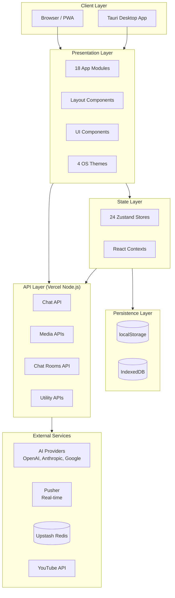
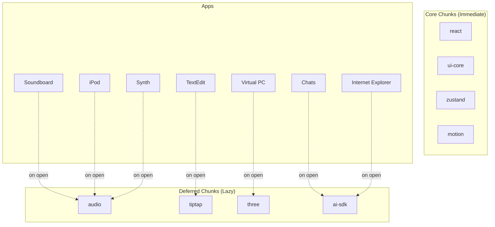
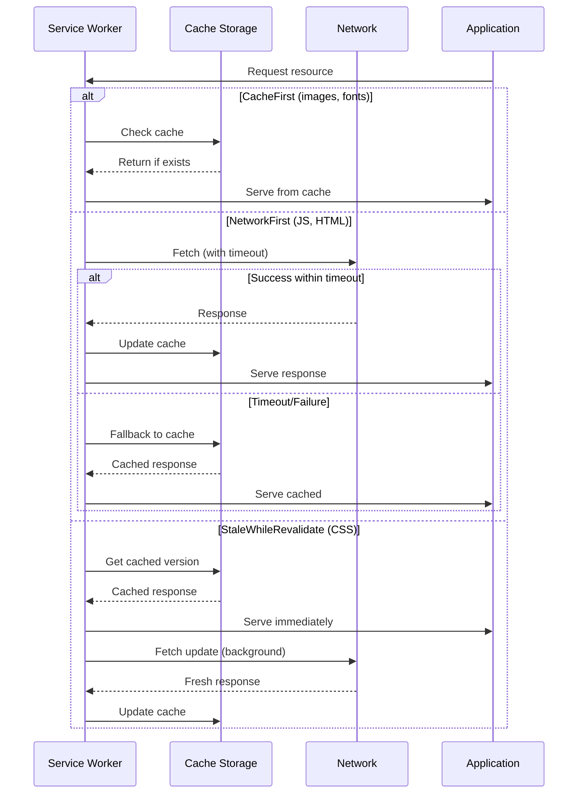
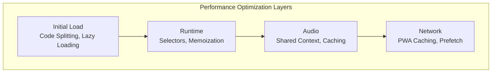
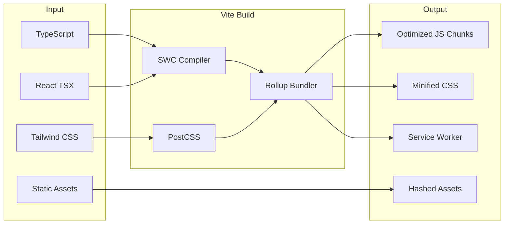

# Architecture & Build

Vite + Bun build system with multiple deployment targets and optimized chunk splitting for performance.

## System Architecture Overview



## Deployment Targets

| Target | Technology | Description |
|--------|------------|-------------|
| **Web (PWA)** | Vercel | Primary deployment with CDN, serverless functions |
| **Desktop** | Tauri | Native app for macOS, Windows, Linux |
| **Development** | Vite | Local server with HMR |

```mermaid
graph LR
    subgraph Source
        A[Source Code]
    end
    
    subgraph Build["Vite + Bun"]
        B[Bundle & Optimize]
    end
    
    subgraph Targets
        C[Web PWA]
        D[Desktop]
        E[Dev Server]
    end
    
    A --> B
    B --> C
    B --> D
    B --> E
    
    C --> F[Vercel CDN]
    D --> G[Tauri - macOS/Windows/Linux]
    E --> H[localhost + HMR]
```



## Chunk Splitting Strategy

The build system uses intelligent chunk splitting to optimize initial load time while enabling on-demand loading of heavy dependencies.

### Core Chunks (Immediate Load)

These chunks are loaded on initial page load:

| Chunk | Packages | Size |
|-------|----------|------|
| `react` | react, react-dom | ~150KB |
| `ui-core` | @radix-ui/* (dialog, dropdown, select, etc.) | ~80KB |
| `zustand` | zustand, persist middleware | ~10KB |
| `motion` | framer-motion | ~100KB |

### Deferred Chunks (Lazy Load)

These chunks are loaded when their corresponding apps are opened:

| Chunk | Contents | Trigger Apps |
|-------|----------|--------------|
| `audio` | tone.js, wavesurfer.js | Soundboard, iPod, Synth |
| `tiptap` | @tiptap/* (editor framework) | TextEdit |
| `three` | three.js (3D rendering) | Virtual PC |
| `ai-sdk` | ai, @ai-sdk/* | Chats, Internet Explorer |



### Lazy Component Pattern

Apps use React's lazy loading with a custom wrapper for HMR compatibility:

```typescript
// Lazy loading with caching for HMR
function createLazyComponent<T = unknown>(
  importFn: () => Promise<{ default: ComponentType<AppProps<T>> }>,
  cacheKey: string
): ComponentType<AppProps<T>> {
  // Return cached component if exists (prevents HMR issues)
  const cached = lazyComponentCache.get(cacheKey);
  if (cached) return cached;

  const LazyComponent = lazy(importFn);
  
  const WrappedComponent = (props: AppProps<T>) => (
    <Suspense fallback={null}>
      <LazyComponent {...props} />
      <LoadSignal instanceId={props.instanceId} />
    </Suspense>
  );
  
  lazyComponentCache.set(cacheKey, WrappedComponent);
  return WrappedComponent;
}
```

## PWA Caching Strategy

The service worker implements different caching strategies based on resource type:

| Resource Pattern | Strategy | TTL | Rationale |
|-----------------|----------|-----|-----------|
| Navigation (HTML) | NetworkFirst | 1 day | Always get latest app shell |
| JS Chunks | NetworkFirst (3s timeout) | 1 day | Fresh code with fast fallback |
| CSS | StaleWhileRevalidate | 7 days | Use cached, update in background |
| Images | CacheFirst | 30 days | Rarely change, prioritize speed |
| Fonts | CacheFirst | 1 year | Never change once deployed |
| API Responses | NetworkOnly | - | Always fresh data |

### Cache Invalidation



## Module Resolution

The project uses TypeScript path aliases for clean imports:

| Alias | Path | Usage |
|-------|------|-------|
| `@/` | `src/` | Source code root |
| `@/components` | `src/components/` | UI components |
| `@/hooks` | `src/hooks/` | Custom hooks |
| `@/stores` | `src/stores/` | Zustand stores |
| `@/apps` | `src/apps/` | App modules |
| `@/utils` | `src/utils/` | Utility functions |
| `@/lib` | `src/lib/` | Libraries |
| `@/types` | `src/types/` | TypeScript types |

## Environment Configuration

### Development
```bash
# Local development with HMR
bun run dev           # Vite dev server
bun run dev:vercel    # Vercel CLI (recommended for API routes)
```

### Production Build
```bash
bun run build         # Production build
bun run preview       # Preview production build
```

### Desktop (Tauri)
```bash
bun run tauri:dev     # Development with native shell
bun run tauri:build   # Build native applications
```

## Performance Optimizations

### Initial Load Optimizations

1. **Code Splitting**: Apps loaded on-demand via React.lazy
2. **Font Loading**: System font stacks with web font fallbacks
3. **Image Optimization**: Responsive images, WebP format
4. **CSS Layers**: Tailwind with theme-specific overrides

### Runtime Optimizations

1. **Zustand Selectors**: Fine-grained subscriptions prevent re-renders
2. **Memo/Callback**: Strategic memoization for expensive computations
3. **Virtual Lists**: Large lists use virtualization (iPod, Finder)
4. **Debounced Actions**: User inputs debounced for performance

### Audio Optimizations

1. **Shared AudioContext**: Single context prevents resource exhaustion
2. **Lazy AudioBuffer Loading**: Sounds loaded on first interaction
3. **LRU Cache**: Limited audio buffer cache with eviction
4. **Concurrent Source Limiting**: Prevents audio overload



## Build Pipeline



## Related Documentation

- [Application Framework](/docs/application-framework) - App structure and lifecycle
- [State Management](/docs/state-management) - Zustand stores and persistence
- [API Architecture](/docs/api-architecture) - Backend API design
