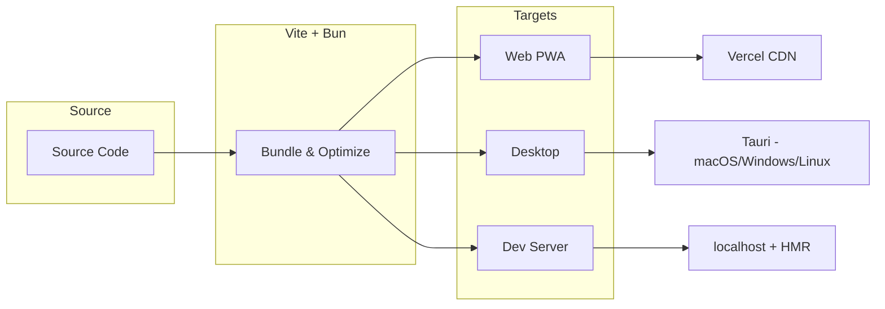
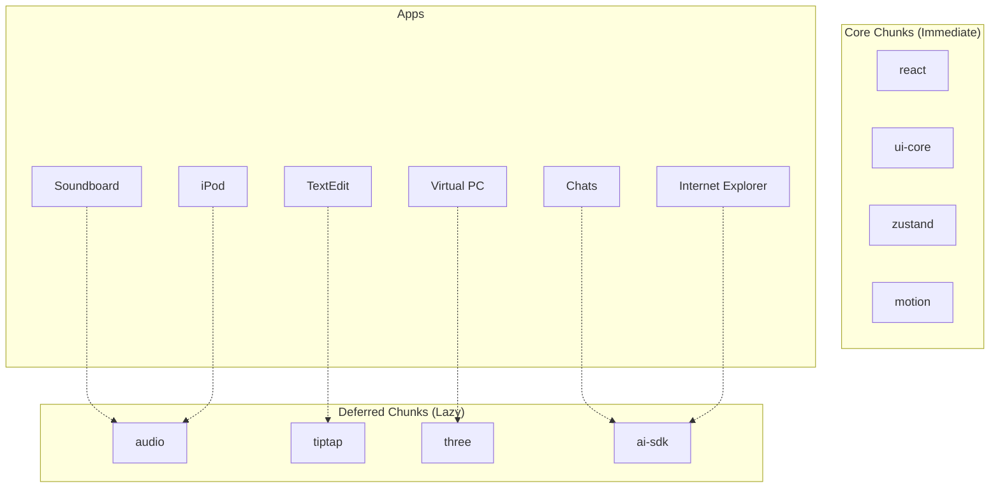

# Architecture & Build

Vite + Bun build system with multiple deployment targets.

## Deployment Targets

- **Web (PWA):** Deployed to Vercel
- **Desktop:** Tauri for macOS/Windows/Linux
- **Development:** Local with HMR



## Chunk Splitting

**Core Chunks (Immediate):**
```
react: ["react", "react-dom"]
"ui-core": ["@radix-ui/react-dialog", ...]
zustand: ["zustand"]
motion: ["framer-motion"]
```

**Deferred Chunks:**

| Chunk | Contents | Trigger |
|-------|----------|---------|
| `audio` | tone, wavesurfer.js | Soundboard/iPod |
| `tiptap` | @tiptap/* | TextEdit |
| `three` | three.js | PC app |
| `ai-sdk` | ai, @ai-sdk/* | Chats/IE |



## PWA Caching

| Pattern | Strategy | TTL |
|---------|----------|-----|
| Navigation | NetworkFirst | 1 day |
| JS Chunks | NetworkFirst (3s) | 1 day |
| CSS | StaleWhileRevalidate | 7 days |
| Images | CacheFirst | 30 days |
| Fonts | CacheFirst | 1 year |
