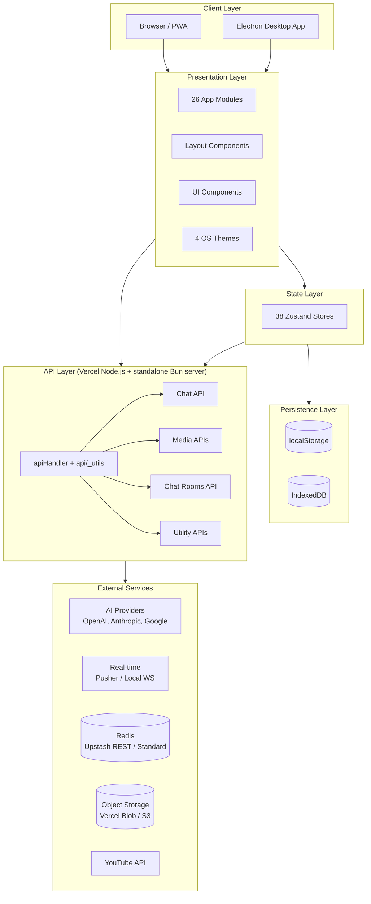
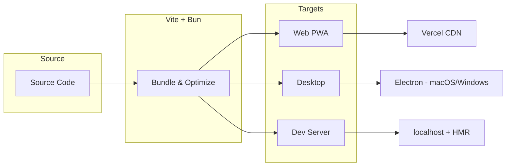
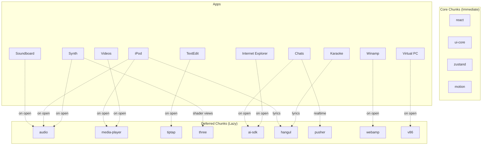
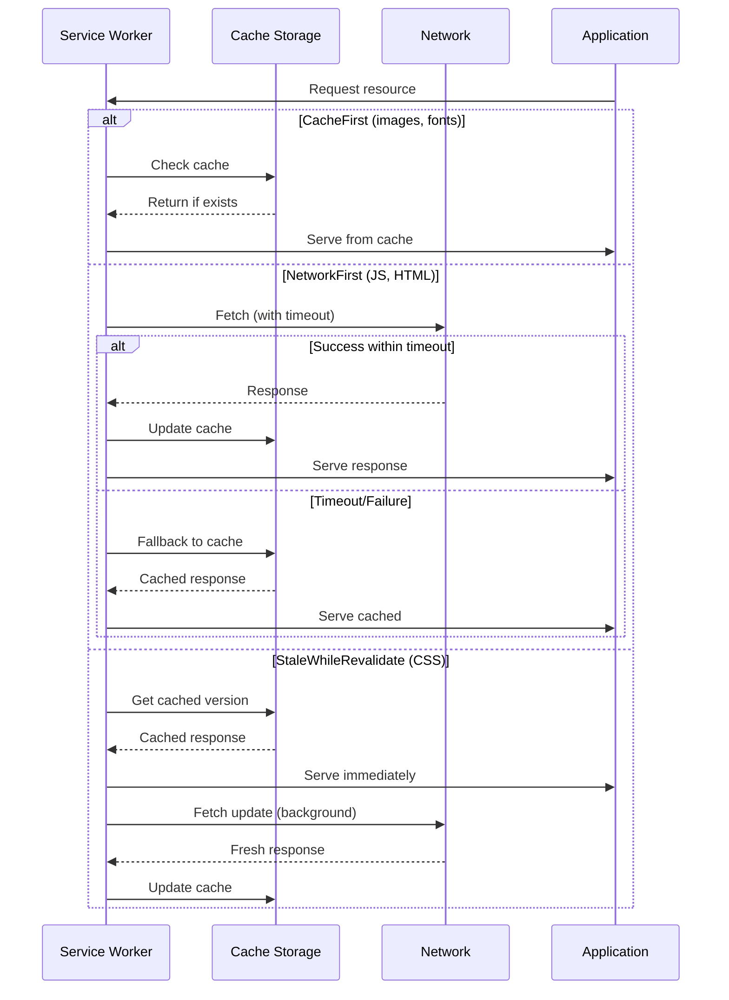
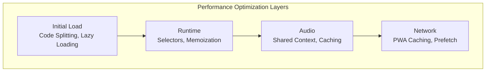
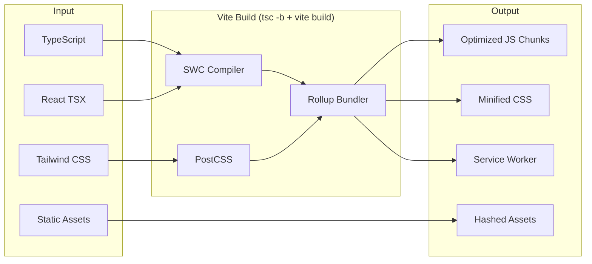

# Architecture & Build

Vite + Bun build system with multiple deployment targets, including dual API runtime support (Vercel serverless and standalone Bun server), plus optimized chunk splitting for performance.

## System Architecture Overview


```mermaid
graph TB
    subgraph Client["Client Layer"]
        Browser[Browser / PWA]
        Desktop[Electron Desktop App]
    end
    
    subgraph Presentation["Presentation Layer"]
        Apps[26 App Modules]
        Layout[Layout Components]
        UI[UI Components]
        Themes[4 OS Themes]
    end
    
    subgraph State["State Layer"]
        Zustand[38 Zustand Stores]
    end
    
    subgraph Persistence["Persistence Layer"]
        LocalStorage[(localStorage)]
        IndexedDB[(IndexedDB)]
    end
    
    subgraph API["API Layer (Vercel Node.js + standalone Bun server)"]
        Shared[apiHandler + api/_utils]
        Chat[Chat API]
        Media[Media APIs]
        Rooms[Chat Rooms API]
        Utility[Utility APIs]
    end
    
    subgraph External["External Services"]
        AI[AI Providers<br/>OpenAI, Anthropic, Google]
        Realtime[Real-time<br/>Pusher / Local WS]
        Redis[(Redis<br/>Upstash REST / Standard)]
        ObjectStorage[(Object Storage<br/>Vercel Blob / S3)]
        YouTube[YouTube API]
    end
    
    Browser --> Presentation
    Desktop --> Presentation
    Presentation --> State
    State --> Persistence
    Presentation --> API
    Shared --> Chat
    Shared --> Media
    Shared --> Rooms
    Shared --> Utility
    API --> External
    State --> API
```

## Deployment Targets

| Target | Technology | Description |
|--------|------------|-------------|
| **Web (PWA)** | Vercel | Primary deployment with CDN, serverless functions |
| **Desktop** | Electron + electron-builder | Native installers for macOS and Windows; Linux AppImage target configured |
| **Development** | Vite + Bun | Local frontend with HMR and optional standalone API proxy |
| **Self-hosted API** | Bun (`Bun.serve`) | Run `api/*` routes without Vercel via `scripts/api-standalone-server.ts` |
| **Docker / Coolify** | Dockerfile + Bun | Container deployment with health checks at `/health` |


```mermaid
graph LR
    subgraph Source
        A[Source Code]
    end
    
    subgraph Build["Vite + Bun"]
        B[Bundle & Optimize]
    end
    
    subgraph Targets
        C[Web PWA]
        D[Desktop]
        E[Dev Server]
    end
    
    A --> B
    B --> C
    B --> D
    B --> E
    
    C --> F[Vercel CDN]
    D --> G[Electron - macOS/Windows]
    E --> H[localhost + HMR]
```

## API Runtime Modes

The API layer is shared across two execution environments:

- **Vercel serverless functions:** `api/*` handlers run as Node.js functions for primary web deployment.
- **Standalone Bun server:** `scripts/api-standalone-server.ts` uses `Bun.serve` and adapts requests/responses to the Vercel handler shape for non-Vercel environments.

Shared utilities under `api/_utils/` (~45 modules including `api-handler.ts`, `request-auth.ts`, `redis.ts`, `storage.ts`, `realtime.ts`, `realtime-auth.ts`, `runtime-config.ts`, `_cors.ts`, `_ssrf.ts`, `_rate-limit.ts`, `_validation.ts`, `_logging.ts`, `_analytics.ts`, `_sse.ts`, `_memory.ts`, `auth/`, `irc/`, and MapKit/MusicKit JWT signers) provide consistent API patterns across routes. Domain constants live in owning modules (e.g. `api/_utils/auth/_constants.ts`). Vercel edge OG middleware is in root `middleware.ts`.

Frontend clients under `src/api/` (`auth`, `rooms`, `admin`, `songs`, `listen`, `core`, `telegram`, and `irc`) centralize request logic for app modules; the Cloud Sync v2 client engine lives in `src/sync/`.

## Chunk Splitting Strategy

The build system uses intelligent chunk splitting to optimize initial load time while enabling on-demand loading of heavy dependencies.

### Core Chunks (Immediate Load)

These chunks are loaded on initial page load:

| Chunk | Packages | Size |
|-------|----------|------|
| `react` | react, react-dom | ~150KB |
| `ui-core` | @radix-ui/* (dialog, dropdown, select, etc.) | ~80KB |
| `zustand` | zustand, persist middleware | ~10KB |
| `motion` | motion | ~100KB |

### Deferred Chunks (Lazy Load)

These chunks are loaded when their corresponding apps are opened:

| Chunk | Contents | Trigger Apps |
|-------|----------|--------------|
| `audio` | tone.js, wavesurfer.js, audio-buffer-utils | Soundboard, iPod, Synth |
| `media-player` | react-player | iPod, Videos |
| `tiptap` | @tiptap/* (editor framework) | TextEdit |
| `three` | three.js (3D rendering) | Synth and shader wallpapers |
| `ai-sdk` | ai, @ai-sdk/* | Chats, Internet Explorer |
| `hangul` | hangul-romanization | Karaoke and iPod lyrics |
| `pusher` | pusher-js | Chats realtime |
| `webamp` | webamp | Winamp |
| `v86` | v86 emulator runtime (lazy dynamic import) | Virtual PC |


```mermaid
graph TD
    subgraph Core["Core Chunks (Immediate)"]
        R[react]
        UI[ui-core]
        Z[zustand]
        M[motion]
    end
    
    subgraph Deferred["Deferred Chunks (Lazy)"]
        AU[audio]
        MP[media-player]
        TT[tiptap]
        TH[three]
        AI[ai-sdk]
        H[hangul]
        P[pusher]
        W[webamp]
        V[v86]
    end
    
    subgraph Apps
        SB[Soundboard]
        IP[iPod]
        SY[Synth]
        TE[TextEdit]
        PC[Virtual PC]
        CH[Chats]
        IE[Internet Explorer]
        KA[Karaoke]
        VI[Videos]
        WA[Winamp]
    end
    
    SB -.->|"on open"| AU
    IP -.->|"on open"| AU
    IP -.->|"on open"| MP
    IP -.->|"lyrics"| H
    SY -.->|"on open"| AU
    SY -.->|"shader views"| TH
    TE -.->|"on open"| TT
    PC -.->|"on open"| V
    CH -.->|"on open"| AI
    CH -.->|"realtime"| P
    IE -.->|"on open"| AI
    KA -.->|"lyrics"| H
    VI -.->|"on open"| MP
    WA -.->|"on open"| W
```

### Lazy Component Pattern

Apps use React's lazy loading with a custom wrapper for HMR compatibility:

```typescript
// Lazy loading with caching for HMR
function createLazyComponent<T = unknown>(
  importFn: () => Promise<{ default: ComponentType<AppProps<T>> }>,
  cacheKey: string
): ComponentType<AppProps<T>> {
  // Return cached component if exists (prevents HMR issues)
  const cached = lazyComponentCache.get(cacheKey);
  if (cached) return cached;

  const LazyComponent = lazy(importFn);
  
  const WrappedComponent = (props: AppProps<T>) => (
    <Suspense fallback={null}>
      <LazyComponent {...props} />
      <LazyLoadSignal instanceId={props.instanceId} />
    </Suspense>
  );
  
  lazyComponentCache.set(cacheKey, WrappedComponent);
  return WrappedComponent;
}
```

## PWA Caching Strategy

The service worker implements different caching strategies based on resource type:

| Resource Pattern | Strategy | TTL | Rationale |
|-----------------|----------|-----|-----------|
| Navigation (HTML) | NetworkFirst | 1 day | Always get latest app shell; stale shell entries are purged on activation after deploys |
| `/assets/*.js` (Vite hashed chunks) | CacheFirst | 1 day | New deploys get new filenames |
| Other same-origin `.js` | NetworkFirst (3s timeout) | 1 day | Fresh code with fast fallback |
| CSS | StaleWhileRevalidate | 7 days | Use cached, update in background |
| Images | CacheFirst | 30 days | Rarely change, prioritize speed |
| Fonts | CacheFirst | 1 year | Never change once deployed |
| `/api/*` requests | Network (excluded from SW cache) | - | Navigate denylist; fetch goes to network |

### Cache Invalidation


```mermaid
sequenceDiagram
    participant SW as Service Worker
    participant Cache as Cache Storage
    participant Network as Network
    participant App as Application
    
    App->>SW: Request resource
    alt CacheFirst (images, fonts)
        SW->>Cache: Check cache
        Cache-->>SW: Return if exists
        SW->>App: Serve from cache
    else NetworkFirst (JS, HTML)
        SW->>Network: Fetch (with timeout)
        alt Success within timeout
            Network-->>SW: Response
            SW->>Cache: Update cache
            SW->>App: Serve response
        else Timeout/Failure
            SW->>Cache: Fallback to cache
            Cache-->>SW: Cached response
            SW->>App: Serve cached
        end
    else StaleWhileRevalidate (CSS)
        SW->>Cache: Get cached version
        Cache-->>SW: Cached response
        SW->>App: Serve immediately
        SW->>Network: Fetch update (background)
        Network-->>SW: Fresh response
        SW->>Cache: Update cache
    end
```

## Module Resolution

The project uses TypeScript path aliases for clean imports:

| Alias | Path | Usage |
|-------|------|-------|
| `@/` | `src/` | All source imports (e.g. `@/components/...`, `@/stores/...`, `@/apps/...`) |

## Environment Configuration

### Development
```bash
# Local development with HMR (implemented by scripts/dev-with-api.ts: API on 3000, Vite on 5173, /api and /ws proxied)
bun run dev           # Full stack (API + Vite with proxy) — the default
bun run dev:vite      # Vite dev server only (frontend-only, no API)
bun run dev:api       # Standalone Bun API server only (port 3000)
```

### Production Build
```bash
bun run build         # TypeScript compile (tsc -b) + Vite production build
bun run preview       # Preview production build
```

### Desktop (Electron)
```bash
bun run electron:dev            # Bundle and launch Electron against local Vite
bun run electron:build          # Build desktop artifacts for the current OS (use --mac, --win, or --linux flags for cross-target builds)
bun run electron:build:mac      # Build macOS DMG/ZIP artifacts
bun run electron:build:windows  # Build Windows NSIS installer
```

## Performance Optimizations

### Runtime Stability & App Coordination

1. **Error Boundaries:** Desktop-level and app-level boundaries isolate crashes and allow targeted recovery flows.
2. **Typed App Event Bus:** `src/utils/appEventBus.ts` defines typed primitives for app launch/update, window focus, Spotlight/Expose toggles, and file/document events.

### Initial Load Optimizations

1. **Code Splitting**: Apps loaded on-demand via React.lazy
2. **Font Loading**: System font stacks with web font fallbacks
3. **Image Optimization**: Responsive images, WebP format
4. **CSS Layers**: Tailwind with theme-specific overrides
5. **Locale Loading**: Non-default locales are loaded lazily via dynamic imports

### Runtime Optimizations

1. **Zustand Selectors**: Fine-grained subscriptions prevent re-renders
2. **Memo/Callback**: Strategic memoization for expensive computations
3. **Virtual Lists**: Large lists use virtualization (iPod, Finder)
4. **Debounced Actions**: User inputs debounced for performance
5. **Spotlight Offloading**: Spotlight indexing/search for dynamic datasets runs in a dedicated Web Worker

### Audio Optimizations

1. **Shared AudioContext**: Single context prevents resource exhaustion
2. **Lazy AudioBuffer Loading**: Sounds loaded on first interaction
3. **LRU Cache**: Limited audio buffer cache with eviction
4. **Concurrent Source Limiting**: Prevents audio overload


```mermaid
graph TD
    subgraph Optimization["Performance Optimization Layers"]
        L1[Initial Load<br/>Code Splitting, Lazy Loading]
        L2[Runtime<br/>Selectors, Memoization]
        L3[Audio<br/>Shared Context, Caching]
        L4[Network<br/>PWA Caching, Prefetch]
    end
    
    L1 --> L2 --> L3 --> L4
```

## Build Pipeline


```mermaid
flowchart LR
    subgraph Input
        TS[TypeScript]
        TSX[React TSX]
        CSS[Tailwind CSS]
        Assets[Static Assets]
    end
    
    subgraph Vite["Vite Build (tsc -b + vite build)"]
        SWC[SWC Compiler]
        Rollup[Rollup Bundler]
        PostCSS[PostCSS]
    end
    
    subgraph Output
        JS[Optimized JS Chunks]
        StyleSheet[Minified CSS]
        Static[Hashed Assets]
        SW[Service Worker]
    end
    
    TS --> SWC
    TSX --> SWC
    CSS --> PostCSS
    SWC --> Rollup
    PostCSS --> Rollup
    Assets --> Static
    Rollup --> JS
    Rollup --> StyleSheet
    Rollup --> SW
```

## Related Documentation

- [Application Framework](/docs/application-framework) - App structure and lifecycle
- [State Management](/docs/state-management) - Zustand stores and persistence
- [API Architecture](/docs/api-architecture) - Backend API design
- [Self-hosting on VPS](/docs/self-hosting-vps) - Run API/frontend without Vercel
