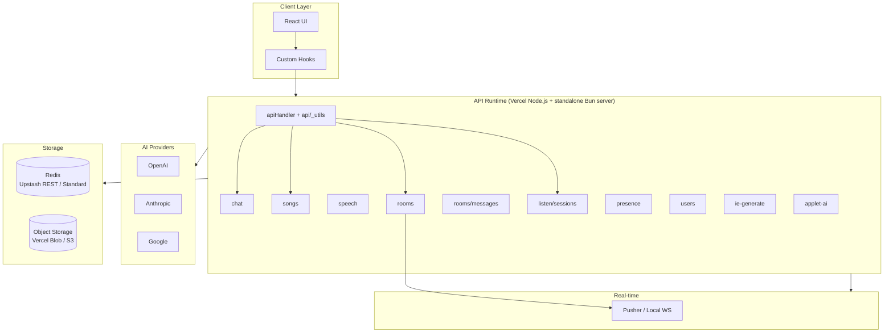
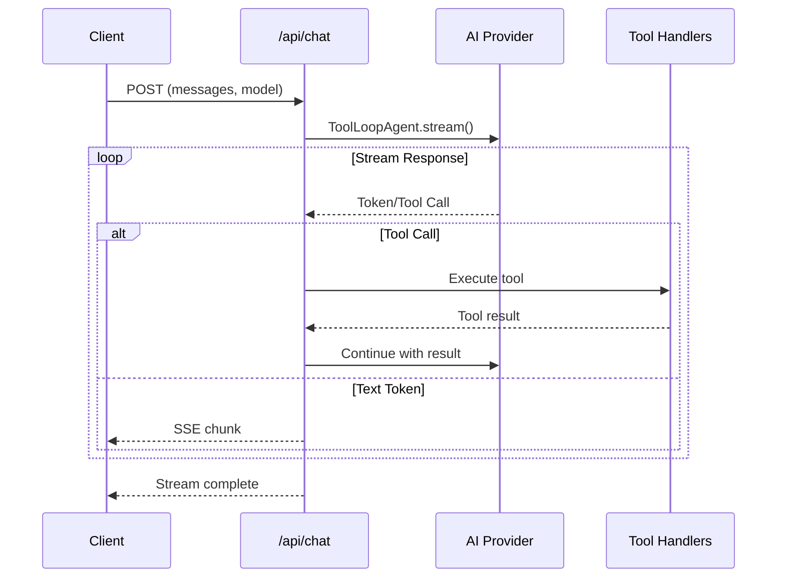

# API Architecture

ryOS APIs are implemented as Vercel-style Node.js route handlers under `api/`. They run on Vercel serverless functions or via the standalone Bun API server for self-hosted deployments, with shared `apiHandler` and `api/_utils` primitives providing consistent CORS, method routing, auth, and error handling patterns.

## Architecture Overview


```mermaid
graph TB
    subgraph Client["Client Layer"]
        UI[React UI]
        Hooks[Custom Hooks]
    end
    
    subgraph API["API Runtime (Vercel Node.js + standalone Bun server)"]
        Handler[apiHandler + api/_utils]
        ChatAPI[chat]
        SongAPI[songs]
        SpeechAPI[speech]
        RoomsAPI[rooms]
        MessagesAPI[rooms/messages]
        ListenAPI[listen/sessions]
        PresenceAPI[presence]
        UsersAPI[users]
        IEAPI[ie-generate]
        AppletAPI[applet-ai]
    end
    
    subgraph AI["AI Providers"]
        OpenAI[OpenAI]
        Anthropic[Anthropic]
        Google[Google]
    end
    
    subgraph Storage["Storage"]
        Redis[(Redis<br/>Upstash REST / Standard)]
        ObjectStorage[(Object Storage<br/>Vercel Blob / S3)]
    end
    
    subgraph Realtime["Real-time"]
        RealtimeProvider[Pusher / Local WS]
    end
    
    UI --> Hooks
    Hooks --> API
    Handler --> ChatAPI
    Handler --> SongAPI
    Handler --> RoomsAPI
    Handler --> ListenAPI
    API --> AI
    API --> Storage
    API --> Realtime
    RoomsAPI --> RealtimeProvider
```

## API Directory Structure

```
api/
├── _utils/                    # Shared API primitives
│   ├── api-handler.ts         # Shared handler wrapper (CORS, methods, auth, errors)
│   ├── request-auth.ts        # Header parsing + auth resolution
│   ├── redis.ts               # Redis client factory (Upstash REST + standard Redis/ioredis)
│   ├── storage.ts             # Object storage adapter (Vercel Blob + S3-compatible)
│   ├── realtime.ts            # Realtime event abstraction (Pusher + local WebSocket)
│   ├── runtime-config.ts      # Client runtime config (origins, realtime, pusher)
│   ├── _cors.ts               # CORS helpers (incl. wildcard subdomain patterns)
│   ├── _ssrf.ts               # SSRF-safe fetch/URL validation
│   ├── _rate-limit.ts         # Rate limiting primitives
│   ├── _validation.ts         # Input validation helpers
│   ├── _logging.ts            # Structured request logging
│   ├── _analytics.ts          # Lightweight per-day API usage analytics
│   ├── _sse.ts                # SSE helpers
│   ├── _memory.ts             # AI conversation memory helpers
│   ├── _song-service.ts       # Song storage service
│   ├── _hash.ts               # Hashing utilities
│   ├── _url.ts                # URL utilities
│   ├── og-share.ts            # OpenGraph share image generation
│   ├── auth/                  # Token/password/auth helpers
│   ├── contacts.ts            # Contacts sync helpers
│   ├── heartbeats.ts          # Heartbeat scheduling helpers
│   ├── ryo-conversation.ts    # Unified conversation preparation (web + Telegram)
│   ├── _cookie.ts             # Auth cookie helpers
│   ├── telegram-format.ts     # Telegram message formatting
│   ├── song-library-state.ts  # Song library state helpers
│   └── telegram*.ts           # Telegram bot integration helpers
├── airdrop/                   # AirDrop file sharing endpoints
├── auth/                      # Auth endpoints
├── rooms/                     # Chat room endpoints
├── listen/                    # Listen-together session endpoints
├── songs/                     # Song library endpoints
├── messages/                  # Bulk message endpoints
├── presence/                  # Presence switching + heartbeat endpoints
├── users/                     # User search endpoints
├── ai/                        # AI helper endpoints
├── chat/                      # Chat endpoint with tool definitions
├── sync/                      # Cloud sync endpoints (backup + logical sync domains)
├── telegram/                  # Telegram bot link/disconnect endpoints
├── cron/                      # Scheduled tasks (telegram heartbeat)
├── webhooks/                  # Webhook handlers (telegram)
└── [endpoint].ts              # Individual top-level endpoints (chat, speech, ie-generate, etc.)
```

## Middleware Utilities

The API layer standardizes route behavior through `apiHandler` plus shared `api/_utils/*` modules. This keeps CORS handling, method routing, auth resolution, and error handling consistent across refactored endpoints. CORS supports wildcard subdomain patterns (e.g. `*.example.com`) via `API_ALLOWED_ORIGINS`.

### Imports

Routes import directly from the focused `api/_utils/*` modules (there is no barrel
re-export module):

```typescript
import { apiHandler } from "../_utils/api-handler.js";
import { createRedis } from "../_utils/redis.js";
import { getEffectiveOrigin, isAllowedOrigin, setCorsHeaders } from "../_utils/_cors.js";
import { extractAuth, extractAuthNormalized } from "../_utils/auth/index.js";
```

Domain-specific constants (Redis key prefixes, TTLs) live in their owning module,
e.g. `api/rooms/_helpers/_constants.ts` and `api/_utils/auth/_constants.ts`.

### `apiHandler` Pattern

Refactored routes use `apiHandler()` as the entry wrapper:

```typescript
export default apiHandler<RequestBody>(
  {
    methods: ["POST"],
    auth: "required",
    bodySchema: RequestBodySchema, // Zod schema (implies parseJsonBody)
  },
  async ({ res, user, body, logger, startTime }) => {
    logger.info("Request accepted", { username: user?.username });
    logger.response(200, Date.now() - startTime);
    res.status(200).json({ success: true });
  }
);
```

`apiHandler` provides:

- Shared CORS + origin checks
- Method allow-list enforcement (`405` on unsupported methods)
- Optional/required auth resolution via `request-auth.ts`
- Optional `bodySchema` request-body validation: any object with a `safeParse(data)` method works, and a Zod schema (`z.object(...)`) satisfies it directly. The parsed/typed body is exposed as `body`; invalid bodies short-circuit with `400 { error: "validation_error", issues }`. Setting `bodySchema` implies `parseJsonBody`.
- Shared Redis/logger/request context for handlers
- Consistent `500` handling for uncaught exceptions

### Specialized route wrappers

Routes should default to `apiHandler()`. If an endpoint needs multipart upload, webhook verification, or cron-only auth behavior, it should use a specialized wrapper that keeps the same shared entry flow instead of introducing a separate request-context pattern.

### Auth Utilities

| Function | Description |
|----------|-------------|
| `resolveRequestAuth(req, redis, { required, allowExpired })` | Resolves optional/required auth and validates token |
| `extractAuthNormalized(req)` | Normalized header extraction (`Authorization`, `X-Username`) |
| `validateAuth(redis, username, token, options)` | Low-level token validation + expiry/grace handling |
| `isAdmin(redis, username, token)` | Admin check helper |

> **See Also:** [API Design Guide](/docs/api-design-guide) for comprehensive patterns and examples.

## API Endpoint Inventory

### Authentication APIs

| Endpoint | Methods | Purpose |
|----------|---------|---------|
| `/api/auth/register` | POST | Create user + issue session cookie |
| `/api/auth/login` | POST | Login with password |
| `/api/auth/logout` | POST | Logout current session |
| `/api/auth/logout-all` | POST | Logout all sessions |
| `/api/auth/session` | GET | Restore session from httpOnly cookie |
| `/api/auth/token/verify` | POST | Verify token |
| `/api/auth/token/refresh` | POST | Refresh session cookie |
| `/api/auth/password/check` | GET | Check if password set |
| `/api/auth/password/set` | POST | Set or update password |
| `/api/auth/tokens` | GET | List active tokens |
| `/api/auth/recovery/request` | POST | Request account recovery code |
| `/api/auth/recovery/reset` | POST | Reset password with recovery code |
| `/api/auth/email/set` | POST | Set recovery email |
| `/api/auth/email/verify` | POST | Verify recovery email |
| `/api/auth/email/remove` | POST | Remove recovery email |
| `/api/auth/email/status` | GET | Read recovery email status |
| `/api/auth/account/delete` | POST | Delete authenticated account |

### Core APIs

| Endpoint | Methods | Purpose |
|----------|---------|---------|
| `/api/chat` | POST | AI chat with streaming and tool calling |
| `/api/speech` | POST | Text-to-speech synthesis |
| `/api/audio-transcribe` | POST | Speech-to-text (Whisper) |

### Media APIs

| Endpoint | Methods | Purpose |
|----------|---------|---------|
| `/api/songs` | GET, POST, DELETE | Song list and batch operations |
| `/api/songs/[id]` | GET, POST, DELETE | Single song CRUD + lyrics |
| `/api/youtube-search` | POST | YouTube video search |
| `/api/parse-title` | POST | YouTube title parsing |

### AI Generation APIs

| Endpoint | Methods | Purpose |
|----------|---------|---------|
| `/api/ie-generate` | POST | Internet Explorer time-travel |
| `/api/applet-ai` | POST | Applet AI assistant |
| `/api/ai/extract-memories` | POST | Extract durable memories from daily notes |
| `/api/ai/process-daily-notes` | POST | Process recent daily notes into memory records |
| `/api/ai/cursor-run-status` | GET | Read Cursor cloud-agent run status |
| `/api/ai/cursor-run-followup` | POST | Send a follow-up prompt to a Cursor cloud-agent run |

### Communication APIs

| Endpoint | Methods | Purpose |
|----------|---------|---------|
| `/api/rooms` | GET, POST | Rooms list + create |
| `/api/rooms/[id]` | GET, DELETE | Room detail + delete |
| `/api/rooms/[id]/messages` | GET, POST | Messages |
| `/api/rooms/[id]/messages/[msgId]` | DELETE | Delete message (admin) |
| `/api/messages/bulk` | GET | Bulk messages |
| `/api/presence/switch` | POST | Presence switching |
| `/api/presence/heartbeat` | GET, POST | Global presence (authenticated): list online / heartbeat |
| `/api/rooms/[id]/join` | POST | Join room |
| `/api/rooms/[id]/leave` | POST | Leave room |
| `/api/rooms/[id]/typing` | POST | Broadcast typing indicator |
| `/api/users` | GET | User search |
| `/api/ai/ryo-reply` | POST | AI reply in rooms |
| `/api/share-applet` | GET, POST, PATCH, DELETE | Applet sharing/store |

### Listen APIs

| Endpoint | Methods | Purpose |
|----------|---------|---------|
| `/api/listen/sessions` | GET, POST | List/create listen-together sessions |
| `/api/listen/sessions/[id]` | GET | Fetch session state |
| `/api/listen/sessions/[id]/join` | POST | Join session |
| `/api/listen/sessions/[id]/leave` | POST | Leave session |
| `/api/listen/sessions/[id]/sync` | POST | Sync DJ playback state |
| `/api/listen/sessions/[id]/reaction` | POST | Send emoji reaction |

| `/api/listen/sessions/[id]/transfer-host` | POST | Transfer session host |
| `/api/listen/sessions/[id]/assign-dj` | POST | Assign the session DJ |
| `/api/listen/sessions/[id]/remote-command` | POST | Submit remote playback command |

### IRC APIs

| Endpoint | Methods | Purpose |
|----------|---------|---------|
| `/api/irc/servers` | GET, POST | List/create IRC server configs |
| `/api/irc/servers/[id]` | DELETE | Remove IRC server config (admin) |
| `/api/irc/servers/[id]/channels` | GET | Browse IRC channels |

### Apple Services APIs

| Endpoint | Methods | Purpose |
|----------|---------|---------|
| `/api/mapkit-token` | GET | MapKit JS token |
| `/api/musickit-token` | GET | MusicKit JS token |
| `/api/apple-music-artwork` | GET | Apple Music artwork proxy |

### Analytics & TV APIs

| Endpoint | Methods | Purpose |
|----------|---------|---------|
| `/api/analytics/events` | POST | Record lightweight client analytics events |
| `/api/tv/create-channel` | POST | AI-assisted TV channel creation |
| `/api/currency-rate` | GET | Currency conversion rates |

### Cloud Sync APIs

| Endpoint | Methods | Purpose |
|----------|---------|---------|
| `/api/sync/v2/ops` | POST | Apply a batch of sync ops (per-key last-writer-wins) |
| `/api/sync/v2/changes` | GET | Journal ops after the client cursor (`?since=`) |
| `/api/sync/v2/snapshot` | GET | Full key-value sync state + current cursor |
| `/api/sync/v2/blobs` | POST | Batched content-addressed blob prepare/dedupe + download signing |
| `/api/sync/auto-sync-preference` | GET, PUT | Cross-device Auto Sync toggle |
| `/api/cron/sync-maintenance` | GET | Cron: content-addressed blob GC + user-record healing (`CRON_SECRET`) |

### Telegram APIs

| Endpoint | Methods | Purpose |
|----------|---------|---------|
| `/api/telegram/link/create` | POST | Create Telegram bot link |
| `/api/telegram/link/disconnect` | POST | Disconnect Telegram bot |
| `/api/telegram/link/status` | GET | Check Telegram link status |
| `/api/telegram/heartbeat-settings` | GET, POST | Read/update Telegram heartbeat DM settings |
| `/api/webhooks/telegram` | POST | Telegram bot webhook handler |
| `/api/cron/telegram-heartbeat` | GET | Scheduled Telegram heartbeat |

### Utility APIs

| Endpoint | Methods | Purpose |
|----------|---------|---------|
| `/api/iframe-check` | GET | Check/proxy iframe embedding |
| `/api/link-preview` | GET | OpenGraph metadata extraction |
| `/api/stocks` | GET | Stock quotes |
| `/api/admin` | Various | Admin operations (incl. usage analytics dashboard) |

### AirDrop APIs

| Endpoint | Methods | Purpose |
|----------|---------|---------|
| `/api/airdrop/heartbeat` | POST | Register presence for AirDrop availability |
| `/api/airdrop/discover` | GET | List nearby users available for AirDrop |
| `/api/airdrop/send` | POST | Send file to recipient (max 2MB) |
| `/api/airdrop/respond` | POST | Accept or decline incoming transfer |

## Frontend API Client Layer

Client-side API access is centralized in `src/api/`:

- `src/api/core.ts` - shared request wrapper, auth headers, error normalization
- `src/api/auth.ts` - login/register/token verification/logout flows
- `src/api/rooms.ts` - room, message, and presence operations
- `src/api/admin.ts` - admin actions and dashboard operations (incl. analytics)
- `src/api/songs.ts` - song CRUD/import operations
- `src/api/listen.ts` - listen-together session flows
- `src/api/telegram.ts` - Telegram bot linking and status operations
- `src/api/irc.ts` - IRC server registry operations

## AI Provider Abstraction

Model IDs and metadata are defined in `src/shared/aiModels.ts`. Server provider wiring is in `api/_utils/_aiModels.ts`.

### Supported Models (AI SDK 6.0)

The API uses Vercel AI SDK 6.0 with structured outputs for type-safe responses.

| Provider | Models | Use Cases |
|----------|--------|-----------|
| **OpenAI** | gpt-5.5 | Default chat, code generation |
| **Anthropic** | sonnet-4.6 (claude-sonnet-4-6) | Complex reasoning |
| **Google** | gemini-3-flash, gemini-3.1-pro-preview | Image generation, title parsing |

**Structured Outputs:** Used for deterministic responses like song title parsing (`/api/parse-title`).

### Model Selection

```typescript
// api/_utils/_aiModels.ts
export const getModelInstance = (model: SupportedModel): LanguageModel => {
  switch (model) {
    case "gpt-5.5":
      return openai("gpt-5.5");
    case "sonnet-4.6":
      return anthropic("claude-sonnet-4-6");
    case "gemini-3-flash":
      return google("gemini-3-flash-preview");
    case "gemini-3.1-pro-preview":
      return google("gemini-3.1-pro-preview");
  }
};
```

## Chat API

### Streaming Architecture


```mermaid
sequenceDiagram
    participant Client
    participant API as /api/chat
    participant AI as AI Provider
    participant Tools as Tool Handlers
    
    Client->>API: POST (messages, model)
    API->>AI: ToolLoopAgent.stream()
    
    loop Stream Response
        AI-->>API: Token/Tool Call
        
        alt Tool Call
            API->>Tools: Execute tool
            Tools-->>API: Tool result
            API->>AI: Continue with result
        else Text Token
            API-->>Client: SSE chunk
        end
    end
    
    API-->>Client: Stream complete
```

### Tool Calling System

The chat API provides tools for system control:

```typescript
tools: {
  launchApp: {
    description: "Launch ryOS application",
    parameters: z.object({
      appId: z.enum(["finder", "textedit", "ipod", ...]),
      initialData: z.unknown().optional(),
    }),
  },
  
  mediaControl: {
    description: "Control music/karaoke/videos/TV playback",
    parameters: z.object({
      target: z.enum(["music", "karaoke", "videos", "tv"]).optional(),
      action: z.enum(["toggle", "play", "pause", "next", "previous", ...]),
      title: z.string().optional(),
      artist: z.string().optional(),
    }),
  },
  
  generateHtml: {
    description: "Generate HTML applet",
    parameters: z.object({
      title: z.string(),
      icon: z.string(),
      code: z.string(),
    }),
  },
  
  // ... more tools
}
```

### System Prompts

```typescript
// api/_utils/_aiPrompts.ts
export const CORE_PRIORITY_INSTRUCTIONS = `
  You are Ryo, an AI assistant in ryOS...
`;

export const RYO_PERSONA_INSTRUCTIONS = `
  Ryo's personality and background...
`;

export const CODE_GENERATION_INSTRUCTIONS = `
  HTML applet generation rules...
`;

export const TOOL_USAGE_INSTRUCTIONS = `
  VFS and tool usage patterns...
`;
```

## Song API

### Split Storage Architecture

```mermaid
flowchart TB
    subgraph "Request"
        REQ[API Request]
    end
    
    subgraph "Redis Storage"
        META[(media:song:{id}:meta<br/>Lightweight)]
        CONTENT[(media:song:{id}:content<br/>Heavy Data)]
        SET[(media:song:ids<br/>ID Set)]
    end
    
    REQ --> |List/Search| META
    REQ --> |Full Song| META
    META --> |UUID Lookup| CONTENT
    REQ --> |All IDs| SET
```

### Endpoints

| Route | Action | Description |
|-------|--------|-------------|
| `GET /api/songs` | List | Songs with filters |
| `POST /api/songs` | Create/Import | New songs or bulk import |
| `GET /api/songs/[id]` | Read | Song with lyrics, translations |
| `POST /api/songs/[id]` | Fetch | Body: `{ action: "fetch-lyrics" }` |
| `POST /api/songs/[id]` | Translate | Body: `{ action: "translate-stream" }` |
| `POST /api/songs/[id]` | Furigana | Body: `{ action: "furigana-stream" }` |
| `DELETE /api/songs/[id]` | Delete | Remove song |

## Speech APIs

### Text-to-Speech

```typescript
// api/speech.ts
const providers = {
  openai: {
    models: ["tts-1", "tts-1-hd"],
    voices: ["alloy", "echo", "fable", "onyx", "nova", "shimmer"],
  },
  elevenlabs: {
    models: ["eleven_multilingual_v2", "eleven_turbo_v2"],
    voices: ["custom voice IDs"],
  },
};

// Dual provider support
if (model === "elevenlabs") {
  return generateElevenLabsSpeech(text, voiceId, modelId);
} else {
  return generateSpeech({
    model: openai.speech("tts-1"),
    text,
    voice,
  });
}
```

### Audio Transcription

```typescript
// api/audio-transcribe.ts
const transcription = await openai.audio.transcriptions.create({
  file: audioFile,
  model: "whisper-1",
});
```

## Rate Limiting

### Counter-Based Limiting

```typescript
// api/_utils/_rate-limit.ts
export async function checkCounterLimit({
  key,
  windowSeconds,
  limit,
}: CounterLimitArgs): Promise<CounterLimitResult> {
  // Atomic increment
  const newCount = await redis.incr(key);
  
  // Set expiry on first request
  if (newCount === 1) {
    await redis.expire(key, windowSeconds);
  }
  
  const ttl = await redis.ttl(key);
  
  if (newCount > limit) {
    return { 
      allowed: false, 
      count: newCount, 
      remaining: 0,
      resetSeconds: ttl,
    };
  }
  
  return { 
    allowed: true, 
    remaining: limit - newCount,
  };
}
```

### Rate Limit Configurations

| Endpoint | Burst Limit | Daily/Budget | Window |
|----------|-------------|--------------|--------|
| Chat AI (auth) | 15 | per 5 hours | Fixed window |
| Chat AI (anon) | 3 | per 24 hours | Fixed window |
| Speech TTS | 10/min | 50/day | Fixed |
| IE Generate | 3/min | 10/5hr | Fixed |
| Applet AI (auth text) | 50 | per hour | Fixed |
| Applet AI (anon text) | 15 | per hour | Fixed |
| Applet AI (auth image) | 12 | per hour | Fixed |
| Applet AI (anon image) | 1 | per hour | Fixed |
| Transcribe | 10/min | 50/day | Fixed |
| Parse Title | 15/min | 500/day | Fixed |
| YouTube Search | 20/min | 200/day | Fixed |

## Authentication

### Token Validation

```typescript
// api/_utils/auth/_validate.ts
export async function validateAuth(
  redis: RedisLike,
  username: string,
  authToken: string,
  options: { allowExpired?: boolean; refreshOnGrace?: boolean } = {}
): Promise<AuthValidationResult> {
  // 1. Check active token
  const userKey = getUserTokenKey(username, authToken);
  const exists = await redis.exists(userKey);
  
  if (exists) {
    // Refresh TTL on use
    await redis.expire(userKey, USER_TTL_SECONDS);
    return { valid: true, expired: false };
  }
  
  // 2. Check grace period for expired tokens
  if (options.allowExpired) {
    const lastTokenKey = getLastTokenKey(username);
    const lastTokenData = await redis.get(lastTokenKey);
    // ... grace period logic
  }
  
  return { valid: false };
}
```

### Auth Headers

| Header | Value | Purpose |
|--------|-------|---------|
| `Authorization` | `Bearer <token>` | Authentication token |
| `X-Username` | Username | User identification |

### Token Configuration

| Setting | Value |
|---------|-------|
| Token TTL | 1 year (refreshed on each validated request) |
| Grace period | 30 days |
| Admin bypass | User "ryo" |

## CORS Handling

```typescript
// api/_utils/_cors.ts
export function isAllowedOrigin(origin: string | null): boolean {
  if (!origin) return false;
  
  // Always allow Tailscale origins
  if (isTailscaleOrigin(origin)) return true;
  
  const env = getRuntimeEnv();
  const configuredOrigins = getConfiguredAllowedOrigins();

  // Explicit self-host allowlist (API_ALLOWED_ORIGINS) takes precedence.
  // Supports wildcard subdomain patterns like "*.example.com".
  if (configuredOrigins.allowAll) return true;
  if (configuredOrigins.origins.has(normalizedOrigin)) return true;
  if (configuredOrigins.subdomainSuffixes.some(s => hostname.endsWith(s))) return true;
  
  // Fallback to environment-based checks
  if (env === "production") return origin === PROD_ALLOWED_ORIGIN;
  if (env === "preview") return isVercelPreviewOrigin(origin);
  return isLocalhostOrigin(origin);
}
```

### Response Patterns

Handlers use `apiHandler()` plus `res.status().json()` / `res.status().end()`. Rate-limit responses are built inline in route handlers using `_rate-limit.ts` primitives. Error bodies typically follow `{ error, code?, details? }`.

All error responses follow a consistent format:

```json
{
  "error": "Human-readable error message",
  "code": "MACHINE_READABLE_CODE",
  "details": { "field": "value" }
}
```

Rate limit errors include additional fields:

```json
{
  "error": "rate_limit_exceeded",
  "limit": 30,
  "retryAfter": 45,
  "scope": "burst"
}
```

### SSE Streaming Response

```typescript
const stream = new ReadableStream({
  async start(controller) {
    for await (const chunk of aiStream) {
      controller.enqueue(`data: ${JSON.stringify(chunk)}\n\n`);
    }
    controller.enqueue("data: [DONE]\n\n");
    controller.close();
  },
});

return new Response(stream, {
  headers: {
    "Content-Type": "text/event-stream",
    "Cache-Control": "no-cache",
    "Connection": "keep-alive",
  },
});
```

## Runtime Configuration

Route modules export Vercel-compatible runtime metadata:

```typescript
export const runtime = "nodejs";
export const maxDuration = 60; // seconds (80 for AI endpoints)
```

- On **Vercel**, these exports configure serverless execution.
- On the **standalone Bun server**, `scripts/api-standalone-server.ts` loads and executes the same `api/*` handlers via a request/response adapter.
- API development/runtime scripts use Bun (`bun run dev:api`, `bun run api:start`).

### Realtime Provider Modes

Realtime delivery is selected at runtime:

| Provider | Auth route | Transport | Notes |
|----------|------------|-----------|-------|
| `pusher` (default) | `POST /api/pusher/auth` | Pusher private/presence channels | Used by production web deployments |
| `local` | `POST /api/realtime/ticket` | Standalone Bun WebSocket + Redis pub/sub bridge | Enabled by `REALTIME_PROVIDER=local` and `REALTIME_WS_PATH` |

Cloud Sync v2 publishes `sync-ops` events on per-user sync channels; small remote changes can be applied directly from the realtime payload without an extra HTTP fetch.

## Redis Key Patterns

| Prefix | Purpose | Example |
|--------|---------|---------|
| `rate:*` | Rate limiting | `rate:ai:5h:user:{hash}` |
| `media:song:*` | Song metadata/content | `media:song:abc123:meta` |
| `cache:ie:*` | IE generation cache | `cache:ie:{hash}:2026:versions` |
| `media:applet:share:*` | Shared applets | `media:applet:share:xyz` |
| `auth:session:*` | Auth sessions | `auth:session:{tokenHash}` |
| `chat:rooms:*` | Chat room metadata/messages/presence | `chat:rooms:general:messages` |
| `sync:backup:user:*` | Manual backup metadata | `sync:backup:user:alice:meta` |
| `sync:v2:user:{username}:seq` | Sync v2 journal cursor (op counter) | `sync:v2:user:alice:seq` |
| `sync:v2:user:{username}:kv` | Sync v2 key-value state (hash: key -> entry) | `sync:v2:user:alice:kv` |
| `sync:v2:user:{username}:journal` | Sync v2 op journal | `sync:v2:user:alice:journal` |
| `sync:v2:user:{username}:blobs` | Sync v2 content-hash blob registry | `sync:v2:user:alice:blobs` |
| `sync:maintenance:cursor` | Sync maintenance cron scan cursor | `sync:maintenance:cursor` |
| `analytics:api:*` | Daily API metrics | `analytics:api:requests:2026-03-10` |
| `analytics:product:*` | Product analytics metrics | `analytics:product:unique-users:2026-03-10` |

## Related Documentation

- [API Design Guide](/docs/api-design-guide) - Implementation patterns and best practices
- [Chat API](/docs/chat-api) - Detailed chat API documentation
- [Song API](/docs/song-api) - Song API reference
- [AI Generation APIs](/docs/ai-generation-apis) - IE and Applet AI
- [Rooms API](/docs/rooms-api) - Chat room management
- [Messages API](/docs/messages-api) - Chat messaging
- [Utility APIs](/docs/utility-apis) - Link preview, iframe check, share applet
