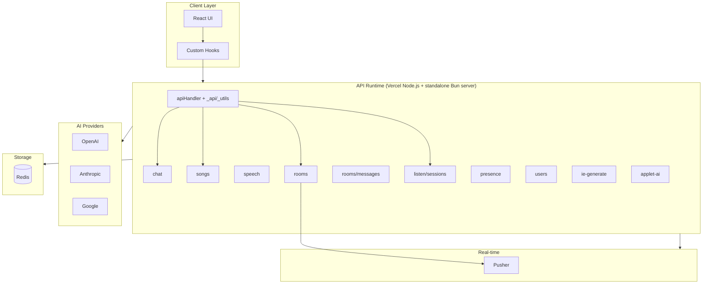
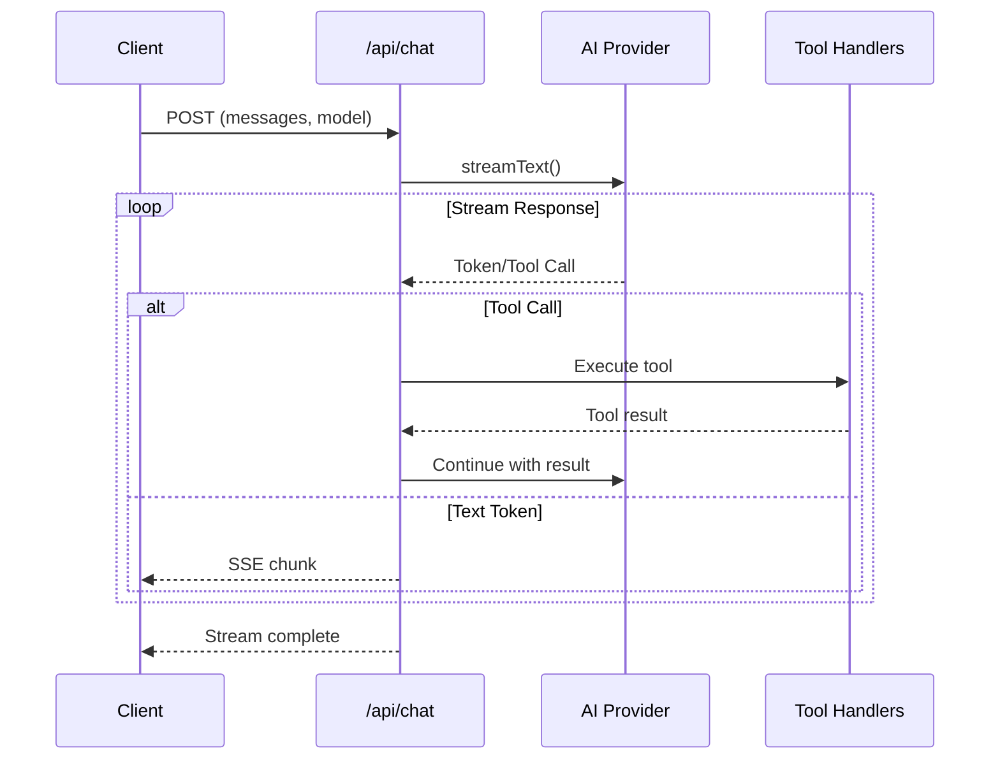
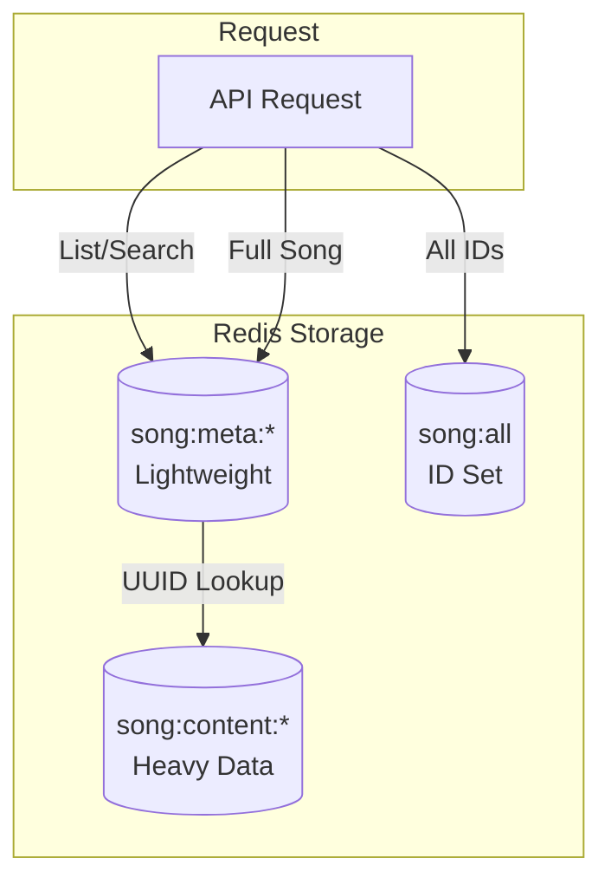

# API Architecture

ryOS APIs are implemented as Vercel-style Node.js route handlers under `_api/`. They run on Vercel serverless functions or via the standalone Bun API server for self-hosted deployments, with shared `apiHandler` and `_api/_utils` primitives providing consistent CORS, method routing, auth, and error handling patterns.

## Architecture Overview


```mermaid
graph TB
    subgraph Client["Client Layer"]
        UI[React UI]
        Hooks[Custom Hooks]
    end
    
    subgraph API["API Runtime (Vercel Node.js + standalone Bun server)"]
        Handler[apiHandler + _api/_utils]
        ChatAPI[chat]
        SongAPI[songs]
        SpeechAPI[speech]
        RoomsAPI[rooms]
        MessagesAPI[rooms/messages]
        ListenAPI[listen/sessions]
        PresenceAPI[presence]
        UsersAPI[users]
        IEAPI[ie-generate]
        AppletAPI[applet-ai]
    end
    
    subgraph AI["AI Providers"]
        OpenAI[OpenAI]
        Anthropic[Anthropic]
        Google[Google]
    end
    
    subgraph Storage["Storage"]
        Redis[(Redis)]
    end
    
    subgraph Realtime["Real-time"]
        Pusher[Pusher]
    end
    
    UI --> Hooks
    Hooks --> API
    Handler --> ChatAPI
    Handler --> SongAPI
    Handler --> RoomsAPI
    Handler --> ListenAPI
    API --> AI
    API --> Storage
    API --> Realtime
    RoomsAPI --> Pusher
```

## API Directory Structure

```
_api/
├── _utils/                    # Shared API primitives
│   ├── api-handler.ts         # Shared handler wrapper (CORS, methods, auth, errors)
│   ├── middleware.ts          # Consolidated re-exports + request-context helpers
│   ├── request-auth.ts        # Header parsing + auth resolution
│   ├── redis.ts               # Redis client factory
│   ├── constants.ts           # Shared constants (REDIS_PREFIXES, TTL, limits)
│   ├── _cors.ts               # CORS helpers
│   ├── _ssrf.ts               # SSRF-safe fetch/URL validation
│   ├── _rate-limit.ts         # Rate limiting primitives
│   ├── _validation.ts         # Input validation helpers
│   ├── _logging.ts            # Structured request logging
│   ├── _sse.ts                # SSE helpers
│   ├── _song-service.ts       # Song storage service
│   └── auth/                  # Token/password/auth helpers
├── auth/                      # Auth endpoints
├── rooms/                     # Chat room endpoints
├── listen/                    # Listen-together session endpoints
├── songs/                     # Song library endpoints
├── messages/                  # Bulk message endpoints
├── presence/                  # Presence switching endpoints
├── users/                     # User search endpoints
├── ai/                        # AI helper endpoints
├── sync/                      # Backup/sync endpoints
└── [endpoint].ts              # Individual top-level endpoints (chat, speech, ie-generate, etc.)
```

## Middleware Utilities

The API layer standardizes route behavior through `apiHandler` plus shared `_api/_utils/*` modules. This keeps CORS handling, method routing, auth resolution, and error handling consistent across refactored endpoints.

### Consolidated Imports

```typescript
import {
  // Route wrapper
  apiHandler,

  // Redis + request context
  createRedis,
  createRequestContext,

  // CORS
  getEffectiveOrigin,
  isAllowedOrigin,
  setCorsHeaders,

  // Auth
  extractAuth,
  extractAuthNormalized,
  isAdmin,

  // Rate limiting
  RATE_LIMITS,

  // Constants
  REDIS_PREFIXES,
  TTL,
  RATE_LIMIT_TIERS,
} from "../_utils/middleware.js";
```

### `apiHandler` Pattern

Refactored routes use `apiHandler()` as the entry wrapper:

```typescript
export default apiHandler<RequestBody>(
  {
    methods: ["POST"],
    auth: "required",
    parseJsonBody: true,
  },
  async ({ res, user, logger, startTime }) => {
    logger.info("Request accepted", { username: user?.username });
    logger.response(200, Date.now() - startTime);
    res.status(200).json({ success: true });
  }
);
```

`apiHandler` provides:

- Shared CORS + origin checks
- Method allow-list enforcement (`405` on unsupported methods)
- Optional/required auth resolution via `request-auth.ts`
- Shared Redis/logger/request context for handlers
- Consistent `500` handling for uncaught exceptions

### Request Context Pattern

For endpoints that still use explicit middleware composition, `createRequestContext()` reduces boilerplate by extracting common data from requests.

**`RequestContext` interface:**

| Property | Type | Description |
|----------|------|-------------|
| `requestId` | string | Unique ID for logging |
| `origin` | string \| null | Effective origin from request |
| `originAllowed` | boolean | Whether origin is allowed |
| `ip` | string | Client IP address |
| `user` | AuthenticatedUser \| null | Authenticated user (if any) |
| `redis` | Redis | Redis client instance |
| `log` | function | Logging helper with request ID |
| `logError` | function | Error logging helper |

### Auth Utilities

| Function | Description |
|----------|-------------|
| `resolveRequestAuth(req, redis, { required, allowExpired })` | Resolves optional/required auth and validates token |
| `extractAuthNormalized(req)` | Normalized header extraction (`Authorization`, `X-Username`) |
| `validateAuth(redis, username, token, options)` | Low-level token validation + expiry/grace handling |
| `isAdmin(redis, username, token)` | Admin check helper |

### Rate Limit Presets

```typescript
// Built-in rate limit configuration helpers
const RATE_LIMITS = {
  burst: (prefix) => ({ prefix: `${prefix}:burst`, windowSeconds: 60, limit: 10, byIp: true }),
  daily: (prefix, limit = 100) => ({ prefix: `${prefix}:daily`, windowSeconds: 86400, limit, byIp: true }),
  hourly: (prefix, limit = 60) => ({ prefix: `${prefix}:hourly`, windowSeconds: 3600, limit, byIp: false }),
  budget5h: (prefix, limit = 15) => ({ prefix: `${prefix}:5h`, windowSeconds: 18000, limit, byIp: false }),
};

// Usage
const burst = RATE_LIMITS.burst("songs");
const daily = RATE_LIMITS.daily("songs", 500);
```

> **See Also:** [API Design Guide](/docs/api-design-guide) for comprehensive patterns and examples.

## API Endpoint Inventory

### Core APIs

| Endpoint | Methods | Purpose |
|----------|---------|---------|
| `/api/chat` | POST | AI chat with streaming and tool calling |
| `/api/speech` | POST | Text-to-speech synthesis |
| `/api/audio-transcribe` | POST | Speech-to-text (Whisper) |

### Media APIs

| Endpoint | Methods | Purpose |
|----------|---------|---------|
| `/api/songs` | GET, POST, DELETE | Song list and batch operations |
| `/api/songs/[id]` | GET, POST, DELETE | Single song CRUD + lyrics |
| `/api/youtube-search` | POST | YouTube video search |
| `/api/parse-title` | POST | YouTube title parsing |

### AI Generation APIs

| Endpoint | Methods | Purpose |
|----------|---------|---------|
| `/api/ie-generate` | POST | Internet Explorer time-travel |
| `/api/applet-ai` | POST | Applet AI assistant |

### Communication APIs

| Endpoint | Methods | Purpose |
|----------|---------|---------|
| `/api/rooms` | GET, POST | Rooms list + create |
| `/api/rooms/[id]` | GET, DELETE | Room detail + delete |
| `/api/rooms/[id]/messages` | GET, POST | Messages |
| `/api/rooms/[id]/messages/[msgId]` | DELETE | Delete message (admin) |
| `/api/messages/bulk` | GET | Bulk messages |
| `/api/presence/switch` | POST | Presence switching |
| `/api/users` | GET | User search |
| `/api/ai/ryo-reply` | POST | AI reply in rooms |
| `/api/share-applet` | GET, POST, PATCH, DELETE | Applet sharing/store |

### Listen APIs

| Endpoint | Methods | Purpose |
|----------|---------|---------|
| `/api/listen/sessions` | GET, POST | List/create listen-together sessions |
| `/api/listen/sessions/[id]` | GET | Fetch session state |
| `/api/listen/sessions/[id]/join` | POST | Join session |
| `/api/listen/sessions/[id]/leave` | POST | Leave session |
| `/api/listen/sessions/[id]/sync` | POST | Sync DJ playback state |
| `/api/listen/sessions/[id]/reaction` | POST | Send emoji reaction |

### Utility APIs

| Endpoint | Methods | Purpose |
|----------|---------|---------|
| `/api/iframe-check` | GET | Check/proxy iframe embedding |
| `/api/link-preview` | GET | OpenGraph metadata extraction |
| `/api/sync/status` | GET | Backup availability/status metadata |
| `/api/admin` | Various | Admin operations |

## Frontend API Client Layer

Client-side API access is centralized in `src/api/`:

- `src/api/core.ts` - shared request wrapper, auth headers, error normalization
- `src/api/auth.ts` - login/register/token verification/logout flows
- `src/api/rooms.ts` - room, message, and presence operations
- `src/api/admin.ts` - admin actions and dashboard operations
- `src/api/songs.ts` - song CRUD/import operations
- `src/api/listen.ts` - listen-together session flows

## AI Provider Abstraction

### Supported Models (AI SDK 6.0)

The API uses Vercel AI SDK 6.0 with structured outputs for type-safe responses.

| Provider | Models | Use Cases |
|----------|--------|-----------|
| **OpenAI** | gpt-5, gpt-5.1, gpt-5-mini, gpt-4o, gpt-4.1 | Default chat, code generation |
| **Anthropic** | claude-4.5, claude-4, claude-3.7, claude-3.5 | Complex reasoning |
| **Google** | gemini-2.5-pro, gemini-2.5-flash, gemini-2.5-flash-image | Image generation, title parsing |

**Structured Outputs:** Used for deterministic responses like song title parsing (`/api/parse-title`).

### Model Selection

```typescript
// _api/_utils/_aiModels.ts
export const getModelInstance = (model: SupportedModel): LanguageModel => {
  switch (model) {
    case "gpt-5":
      return openai("gpt-5");
    case "gpt-5.1":
      return openai("gpt-5.1");
    case "claude-4.5":
      return anthropic("claude-sonnet-4-5");
    case "gemini-2.5-pro":
      return google("gemini-2.5-pro");
    // ... more models
  }
};
```

## Chat API

### Streaming Architecture


```mermaid
sequenceDiagram
    participant Client
    participant API as /api/chat
    participant AI as AI Provider
    participant Tools as Tool Handlers
    
    Client->>API: POST (messages, model)
    API->>AI: streamText()
    
    loop Stream Response
        AI-->>API: Token/Tool Call
        
        alt Tool Call
            API->>Tools: Execute tool
            Tools-->>API: Tool result
            API->>AI: Continue with result
        else Text Token
            API-->>Client: SSE chunk
        end
    end
    
    API-->>Client: Stream complete
```

### Tool Calling System

The chat API provides tools for system control:

```typescript
tools: {
  launchApp: {
    description: "Launch ryOS application",
    parameters: z.object({
      appId: z.enum(["finder", "textedit", "ipod", ...]),
      initialData: z.unknown().optional(),
    }),
  },
  
  ipodControl: {
    description: "Control iPod playback",
    parameters: z.object({
      action: z.enum(["toggle", "play", "pause", "next", "previous", ...]),
      title: z.string().optional(),
      artist: z.string().optional(),
    }),
  },
  
  generateHtml: {
    description: "Generate HTML applet",
    parameters: z.object({
      title: z.string(),
      icon: z.string(),
      code: z.string(),
    }),
  },
  
  // ... more tools
}
```

### System Prompts

```typescript
// _api/_utils/_aiPrompts.ts
export const CORE_PRIORITY_INSTRUCTIONS = `
  You are Ryo, an AI assistant in ryOS...
`;

export const RYO_PERSONA_INSTRUCTIONS = `
  Ryo's personality and background...
`;

export const CODE_GENERATION_INSTRUCTIONS = `
  HTML applet generation rules...
`;

export const TOOL_USAGE_INSTRUCTIONS = `
  VFS and tool usage patterns...
`;
```

## Song API

### Split Storage Architecture


```mermaid
flowchart TB
    subgraph "Request"
        REQ[API Request]
    end
    
    subgraph "Redis Storage"
        META[(song:meta:*<br/>Lightweight)]
        CONTENT[(song:content:*<br/>Heavy Data)]
        SET[(song:all<br/>ID Set)]
    end
    
    REQ --> |List/Search| META
    REQ --> |Full Song| META
    META --> |UUID Lookup| CONTENT
    REQ --> |All IDs| SET
```

### Endpoints

| Route | Action | Description |
|-------|--------|-------------|
| `GET /api/songs` | List | Songs with filters |
| `POST /api/songs` | Create/Import | New songs or bulk import |
| `GET /api/songs/[id]` | Read | Song with lyrics, translations |
| `POST /api/songs/[id]` | Fetch | Body: `{ action: "fetch-lyrics" }` |
| `POST /api/songs/[id]` | Translate | Body: `{ action: "translate-stream" }` |
| `POST /api/songs/[id]` | Furigana | Body: `{ action: "furigana-stream" }` |
| `DELETE /api/songs/[id]` | Delete | Remove song |

## Speech APIs

### Text-to-Speech

```typescript
// _api/speech.ts
const providers = {
  openai: {
    models: ["tts-1", "tts-1-hd"],
    voices: ["alloy", "echo", "fable", "onyx", "nova", "shimmer"],
  },
  elevenlabs: {
    models: ["eleven_multilingual_v2", "eleven_turbo_v2"],
    voices: ["custom voice IDs"],
  },
};

// Dual provider support
if (model === "elevenlabs") {
  return generateElevenLabsSpeech(text, voiceId, modelId);
} else {
  return generateSpeech({
    model: openai.speech("tts-1"),
    text,
    voice,
  });
}
```

### Audio Transcription

```typescript
// _api/audio-transcribe.ts
const transcription = await openai.audio.transcriptions.create({
  file: audioFile,
  model: "whisper-1",
});
```

## Rate Limiting

### Counter-Based Limiting

```typescript
// _api/_utils/_rate-limit.ts
export async function checkCounterLimit({
  key,
  windowSeconds,
  limit,
}: CounterLimitArgs): Promise<CounterLimitResult> {
  // Atomic increment
  const newCount = await redis.incr(key);
  
  // Set expiry on first request
  if (newCount === 1) {
    await redis.expire(key, windowSeconds);
  }
  
  const ttl = await redis.ttl(key);
  
  if (newCount > limit) {
    return { 
      allowed: false, 
      count: newCount, 
      remaining: 0,
      resetSeconds: ttl,
    };
  }
  
  return { 
    allowed: true, 
    remaining: limit - newCount,
  };
}
```

### Rate Limit Configurations

| Endpoint | Burst Limit | Daily/Budget | Window |
|----------|-------------|--------------|--------|
| Chat AI (auth) | 15 | per 5 hours | Sliding |
| Chat AI (anon) | 3 | per 24 hours | Sliding |
| Speech TTS | 10/min | 50/day | Fixed |
| IE Generate | 3/min | 10/5hr | Fixed |
| Applet AI (auth text) | 50 | per hour | Fixed |
| Applet AI (anon text) | 15 | per hour | Fixed |
| Applet AI (auth image) | 12 | per hour | Fixed |
| Applet AI (anon image) | 1 | per hour | Fixed |
| Transcribe | 10/min | 50/day | Fixed |
| Parse Title | 15/min | 500/day | Fixed |
| YouTube Search | 20/min | 200/day | Fixed |

## Authentication

### Token Validation

```typescript
// _api/_utils/auth/_validate.ts
export async function validateAuth(
  redis: RedisLike,
  username: string,
  authToken: string,
  options: { allowExpired?: boolean; refreshOnGrace?: boolean } = {}
): Promise<AuthValidationResult> {
  // 1. Check active token
  const userKey = getUserTokenKey(username, authToken);
  const exists = await redis.exists(userKey);
  
  if (exists) {
    // Refresh TTL on use
    await redis.expire(userKey, USER_TTL_SECONDS);
    return { valid: true, expired: false };
  }
  
  // 2. Check grace period for expired tokens
  if (options.allowExpired) {
    const lastTokenKey = getLastTokenKey(username);
    const lastTokenData = await redis.get(lastTokenKey);
    // ... grace period logic
  }
  
  return { valid: false };
}
```

### Auth Headers

| Header | Value | Purpose |
|--------|-------|---------|
| `Authorization` | `Bearer <token>` | Authentication token |
| `X-Username` | Username | User identification |

### Token Configuration

| Setting | Value |
|---------|-------|
| Token TTL | 90 days |
| Grace period | 30 days |
| Admin bypass | User "ryo" |

## CORS Handling

```typescript
// _api/_utils/_cors.ts
export function isAllowedOrigin(origin: string | null): boolean {
  if (!origin) return false;
  
  // Always allow Tailscale origins
  if (isTailscaleOrigin(origin)) return true;
  
  const env = getRuntimeEnv();
  
  if (env === "production") {
    return origin === PROD_ALLOWED_ORIGIN;
  }
  
  if (env === "preview") {
    return isVercelPreviewOrigin(origin);
  }
  
  // Development
  return isLocalhostOrigin(origin);
}
```

## Response Patterns

### Response Helpers

The middleware provides standardized response helpers for consistent API responses:

```typescript
// JSON response with optional CORS and extra headers
jsonResponse(data, status = 200, origin?, extraHeaders?)

// Error response with optional code and details
errorResponse(message, status = 400, origin?, code?, details?)

// Success response (includes { success: true })
successResponse(data = {}, status = 200, origin?)

// Rate limit response with retry headers
rateLimitResponse(origin, limit, resetSeconds, scope?)
```

**Example Usage:**

```typescript
// Success with data
return jsonResponse({ items: data }, 200, origin);

// Success response
return successResponse({ message: "Created" }, 201, origin);

// Error with code
return errorResponse("Validation failed", 400, origin, "VALIDATION_ERROR", { field: "email" });

// Rate limit exceeded
return rateLimitResponse(origin, 30, 60, "burst");
```

### Error Response Format

All error responses follow a consistent format:

```json
{
  "error": "Human-readable error message",
  "code": "MACHINE_READABLE_CODE",
  "details": { "field": "value" }
}
```

Rate limit errors include additional fields:

```json
{
  "error": "rate_limit_exceeded",
  "limit": 30,
  "retryAfter": 45,
  "scope": "burst"
}
```

### SSE Streaming Response

```typescript
const stream = new ReadableStream({
  async start(controller) {
    for await (const chunk of aiStream) {
      controller.enqueue(`data: ${JSON.stringify(chunk)}\n\n`);
    }
    controller.enqueue("data: [DONE]\n\n");
    controller.close();
  },
});

return new Response(stream, {
  headers: {
    "Content-Type": "text/event-stream",
    "Cache-Control": "no-cache",
    "Connection": "keep-alive",
  },
});
```

## Runtime Configuration

Route modules export Vercel-compatible runtime metadata:

```typescript
export const runtime = "nodejs";
export const maxDuration = 60; // seconds (80 for AI endpoints)
```

- On **Vercel**, these exports configure serverless execution.
- On the **standalone Bun server**, `scripts/api-standalone-server.ts` loads and executes the same `_api/*` handlers via a request/response adapter.
- API development/runtime scripts use Bun (`bun run dev:api`, `bun run api:start`).

## Redis Key Patterns

| Prefix | Purpose | Example |
|--------|---------|---------|
| `rl:ai:` | AI rate limiting | `rl:ai:chat:user123` |
| `song:meta:` | Song metadata | `song:meta:abc123` |
| `song:content:` | Song content | `song:content:abc123` |
| `ie:cache:` | IE generation cache | `ie:cache:hash` |
| `applet:share:` | Shared applets | `applet:share:xyz` |
| `chat:token:user:` | Auth tokens | `chat:token:user:alice:tok` |
| `chat:room:` | Chat room data | `chat:room:general` |

## Related Documentation

- [API Design Guide](/docs/api-design-guide) - Implementation patterns and best practices
- [Chat API](/docs/chat-api) - Detailed chat API documentation
- [Song API](/docs/song-api) - Song API reference
- [AI Generation APIs](/docs/ai-generation-apis) - IE and Applet AI
- [Rooms API](/docs/rooms-api) - Chat room management
- [Messages API](/docs/messages-api) - Chat messaging
- [Utility APIs](/docs/utility-apis) - Link preview, iframe check, share applet
