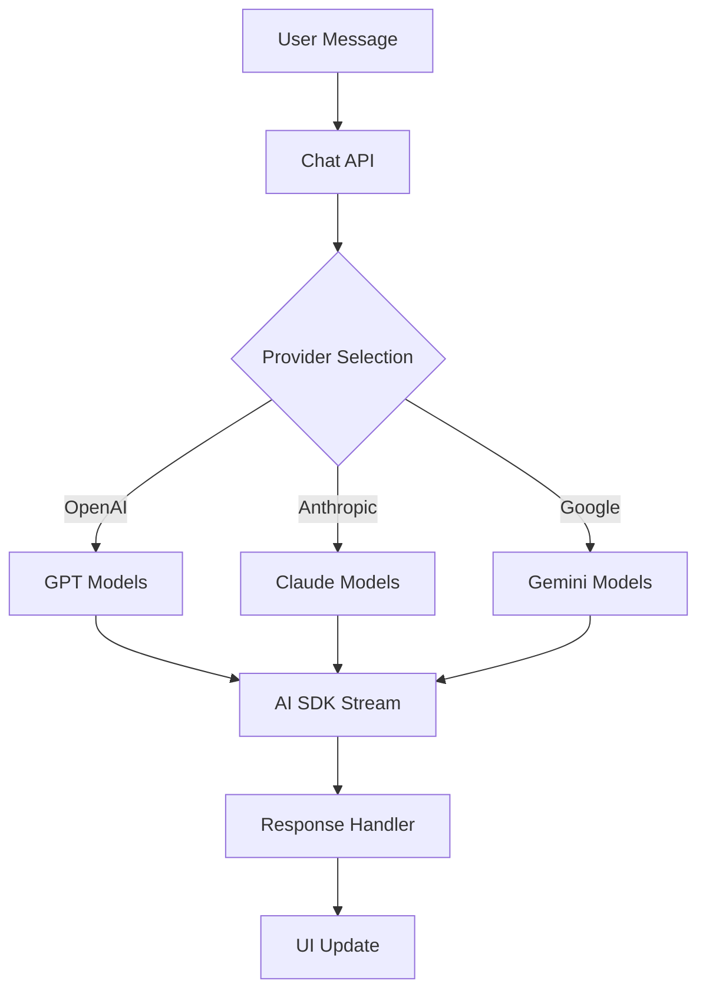
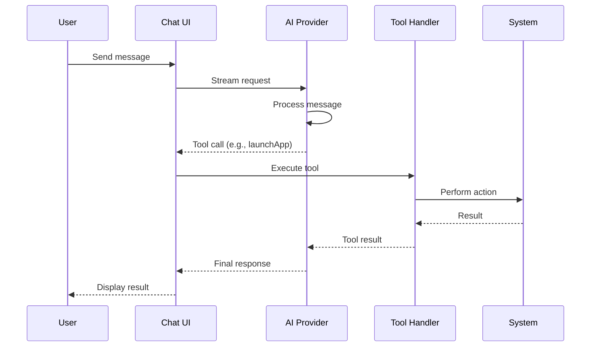

# AI Integration

Multi-provider AI with tool calling support.

## Providers

| Provider | SDK | Models |
|----------|-----|--------|
| OpenAI | `@ai-sdk/openai` | gpt-5, gpt-5.1, gpt-4o |
| Anthropic | `@ai-sdk/anthropic` | claude-4.5, claude-4, claude-3.7 |
| Google | `@ai-sdk/google` | gemini-2.5-pro, gemini-2.5-flash |

## Available Tools

| Tool | Description |
|------|-------------|
| `launchApp` | Open applications |
| `closeApp` | Close applications |
| `ipodControl` | Music playback control |
| `karaokeControl` | Karaoke playback |
| `generateHtml` | Create HTML applets |
| `list` | List VFS items |
| `open` | Open files/apps |
| `read` | Read file contents |
| `write` | Create/modify documents |
| `edit` | Edit existing files |
| `searchSongs` | YouTube music search |
| `settings` | System settings |

