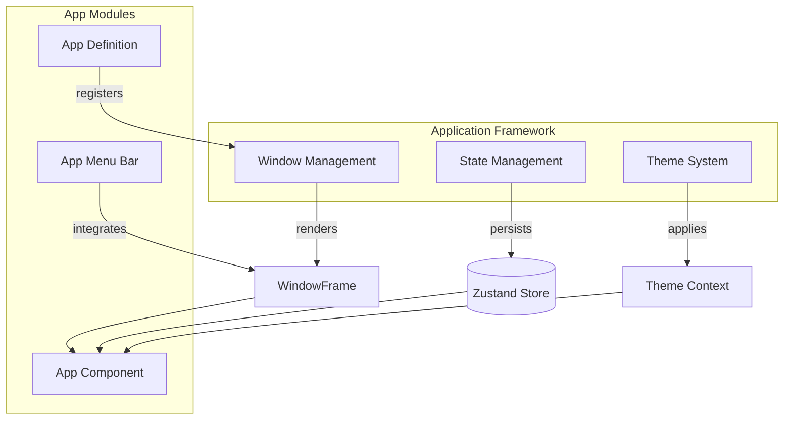
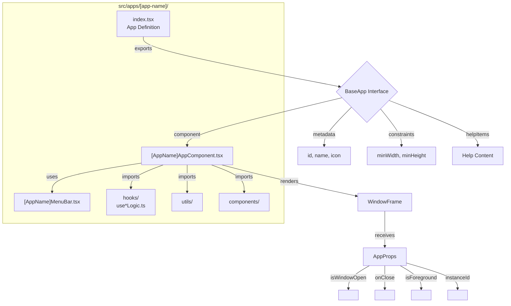

# Application Framework

The ryOS application framework provides a unified system for building and managing desktop-style applications within the browser. It handles window rendering, state management, theming, and app lifecycle, allowing developers to focus on application logic rather than window management infrastructure.

## Overview

The ryOS application framework is built around three core pillars: **Window Management**, **State Management**, and **Theme System**. Together, these systems enable apps to have native desktop-like behavior including multiple windows, window positioning, resizing, minimizing, and theming that adapts to different operating system aesthetics.

Apps in ryOS are organized as self-contained modules in `src/apps/[app-name]/`, each exporting a standardized app definition that includes the app component, metadata, and configuration. The framework handles window lifecycle, state persistence, and theme-aware rendering automatically, while apps focus on their specific functionality.

The framework supports multiple window instances per app (multi-window), allowing users to open several windows of the same application simultaneously. Window state, including position and size, is persisted across sessions. Apps can also define custom window constraints, menu bars, and help content that integrates seamlessly with the system.



## Key Components

| Component | Purpose |
|-----------|---------|
| Window Management | Handles window rendering, positioning, resizing, minimizing, maximizing, and multi-instance support through the `WindowFrame` component and `useWindowManager` hook |
| State Management | Manages app state, window instances, foreground ordering, and persistence using Zustand stores with localStorage integration |
| Theme System | Provides OS-themed appearance (Mac OS X, System 7, Windows XP, Windows 98) with theme-aware components, colors, fonts, and layout metadata |

## App Structure

Apps follow a standardized structure and naming convention. Each app is defined in `src/apps/[app-name]/` with the following typical organization:

- **Main Component**: `[AppName]AppComponent.tsx` - The primary app component that receives `AppProps` and renders the app content wrapped in `WindowFrame`
- **Menu Bar**: `[AppName]MenuBar.tsx` - App-specific menu bar component (rendered outside `WindowFrame` for macOS themes, inside for Windows themes)
- **App Definition**: `index.tsx` or `index.ts` - Exports the app definition object conforming to `BaseApp` interface, including component, metadata, help items, and window constraints
- **Optional Folders**: `hooks/`, `utils/`, `types/`, `components/` - App-specific logic, utilities, types, and sub-components

Apps receive common props via the `AppProps` interface, including `isWindowOpen`, `onClose`, `isForeground`, `instanceId`, and `initialData`. The `WindowFrame` component handles all window chrome, controls, and interactions, while apps focus on their content and functionality.



### App-Specific Hooks Pattern

Each app typically has a **main logic hook** that encapsulates most of the app's state and behavior. This pattern separates UI concerns from business logic and makes apps easier to test and maintain.

**Location:** `src/apps/[app-name]/hooks/use[AppName]Logic.ts`

**Pattern Overview:**

| Aspect | Description |
|--------|-------------|
| Input | Options object with `isWindowOpen`, `isForeground`, `initialData`, `instanceId` |
| Output | Unified object containing state, actions, and UI state |
| Composition | Combines global hooks (useSound, useLyrics, etc.) with Zustand store state |

**Example: iPod Logic Hook**

```typescript
// src/apps/ipod/hooks/useIpodLogic.ts

export interface UseIpodLogicOptions {
  isWindowOpen: boolean;
  isForeground: boolean | undefined;
  initialData: IpodInitialData | undefined;
  instanceId: string | undefined;
}

export function useIpodLogic({
  isWindowOpen,
  isForeground,
  initialData,
  instanceId,
}: UseIpodLogicOptions) {
  // 1. Global hooks for cross-cutting concerns
  const { play: playClickSound } = useSound(Sounds.BUTTON_CLICK);
  const { play: playScrollSound } = useSound(Sounds.IPOD_CLICK_WHEEL);
  const vibrate = useVibration(100, 50);
  const isOffline = useOffline();
  
  // 2. Store state (fine-grained selectors)
  const { tracks, currentSongId, isPlaying, loopCurrent } = useIpodStore(
    useShallow((s) => ({
      tracks: s.tracks,
      currentSongId: s.currentSongId,
      isPlaying: s.isPlaying,
      loopCurrent: s.loopCurrent,
    }))
  );
  
  // 3. Media hooks for specialized functionality
  const { lyrics, isLoading: lyricsLoading } = useLyrics({
    songId: currentSongId,
    title: currentTrack?.title,
    artist: currentTrack?.artist,
  });
  
  const { furiganaMap, soramimiMap } = useFurigana({
    songId: currentSongId,
    lines: lyrics,
    enabled: showFurigana,
  });
  
  // 4. Local state for UI concerns
  const [menuPath, setMenuPath] = useState<string[]>([]);
  const [isFullscreen, setIsFullscreen] = useState(false);
  
  // 5. Handlers that combine state and actions
  const playTrack = useCallback((track: Track) => {
    playClickSound();
    vibrate();
    useIpodStore.getState().setCurrentSongId(track.id);
    useIpodStore.getState().setIsPlaying(true);
  }, [playClickSound, vibrate]);
  
  // 6. Return unified interface for component
  return {
    // State
    tracks,
    currentTrack,
    isPlaying,
    lyrics,
    furiganaMap,
    
    // Actions
    playTrack,
    pauseTrack,
    nextTrack,
    previousTrack,
    
    // UI state
    menuPath,
    setMenuPath,
    isFullscreen,
    setIsFullscreen,
    
    // Status
    isOffline,
    lyricsLoading,
  };
}
```

**Benefits of this pattern:**

1. **Separation of concerns** - UI component focuses on rendering, logic hook handles state
2. **Composability** - Logic hooks compose global hooks and store state cleanly
3. **Testability** - Logic can be tested independently of UI
4. **Reusability** - Same logic can power multiple UI variations (e.g., iPod and Karaoke share patterns)

**Apps using this pattern:**

| App | Logic Hook | Key Responsibilities |
|-----|------------|---------------------|
| iPod | `useIpodLogic` | Playback, lyrics, navigation, fullscreen |
| Finder | `useFinderLogic` | File navigation, selection, operations |
| Chats | `useAiChat` | AI chat, message handling, tool execution |
| Terminal | `useTerminalLogic` | Command execution, history, Vim mode |
| Paint | `usePaintLogic` | Canvas operations, tools, filters |
| Karaoke | `useKaraokeLogic` | Karaoke playback, lyrics sync |
| TextEdit | `useTextEditState` | Document state, file operations |
| Photo Booth | `usePhotoBoothLogic` | Camera, effects, capture |
| Soundboard | `useSoundboardLogic` | Audio recording, playback, boards |
| Synth | `useSynthLogic` | Synthesis, presets, waveform |

## Subsections

- [Window Management](/docs/window-management) - Window rendering, positioning, and frame components
- [State Management](/docs/state-management) - Zustand stores and data persistence
- [Theme System](/docs/theme-system) - Themes, appearance, and visual customization
- [Hooks Architecture](/docs/hooks-architecture) - Custom React hooks for audio, media, and utilities
- [Component Architecture](/docs/component-architecture) - UI component organization and patterns
