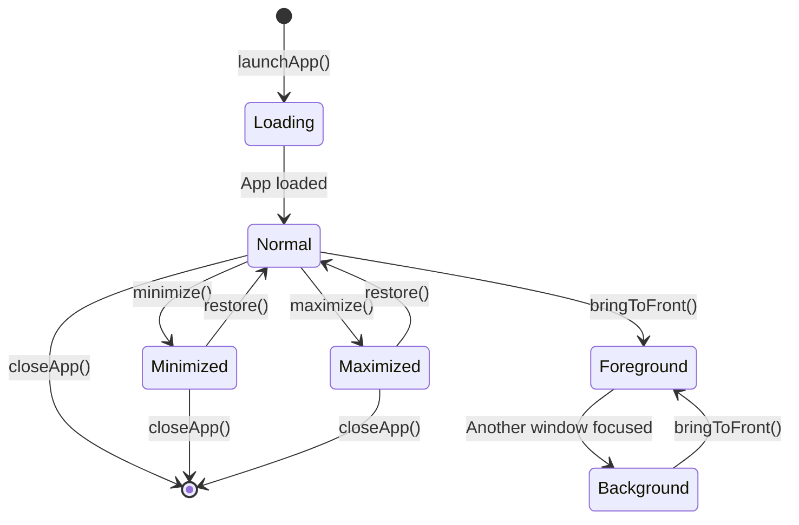
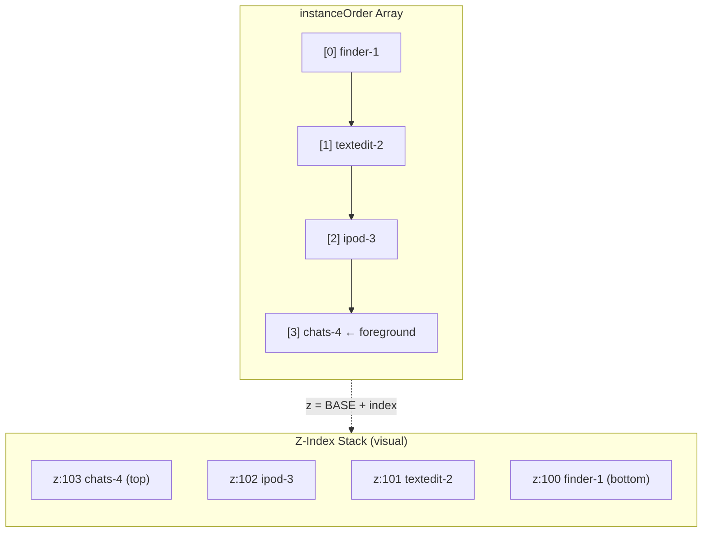

# Window Manager

ryOS implements a sophisticated multi-instance window manager.

## Window Creation Flow

```
User Action → launchApp() → createAppInstance() → AppManager renders
```

## Instance State

```typescript
interface AppInstance {
  instanceId: string;        // Unique numeric ID
  appId: AppId;              // App identifier
  isOpen: boolean;
  isForeground: boolean;
  isMinimized?: boolean;     // Dock/taskbar minimize state
  isLoading?: boolean;       // For lazy-loaded apps
  position?: { x: number; y: number };
  size?: { width: number; height: number };
  title?: string;            // Static title set at creation
  displayTitle?: string;     // Dynamic title (updated by WindowFrame)
  createdAt: number;         // For stable ordering in taskbar
  initialData?: unknown;     // App-specific data passed at launch
}
```

### Window State Transitions



## Z-Index Management

Z-index is calculated from position in `instanceOrder` array. The end of the array is the foreground (top) window.



## Window Constraints

| Property | Type | Description |
|----------|------|-------------|
| `minSize` | `{ width, height }` | Minimum window dimensions |
| `maxSize` | `{ width, height }` | Maximum window dimensions |
| `defaultSize` | `{ width, height }` | Initial window size |
| `mobileDefaultSize` | `{ width, height }` | Size on mobile devices |
| `mobileSquare` | `boolean` | If true, height = width on mobile |

## Multi-Instance Apps

- `textedit` - Multiple documents
- `finder` - Multiple browser windows
- `applet-viewer` - Multiple applets
