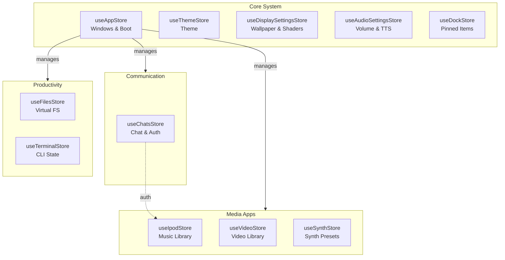
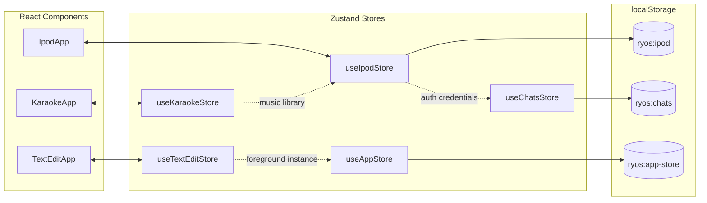

# State Management

ryOS uses Zustand for state management with 21 stores following consistent patterns.

## Store Inventory

| Store | Purpose | Persistence Key |
|-------|---------|-----------------|
| `useAppStore` | Window/instance management, boot state | `ryos:app-store` |
| `useFilesStore` | Virtual filesystem metadata | `ryos:files` |
| `useChatsStore` | Chat rooms, messages, auth | `ryos:chats` |
| `useIpodStore` | Music library, playback | `ryos:ipod` |
| `useThemeStore` | OS theme selection | Manual localStorage |
| `useDisplaySettingsStore` | Wallpaper, shaders | `ryos:display-settings` |
| `useDockStore` | Dock pinned items | `dock-storage` |
| `useAudioSettingsStore` | Volume, TTS settings | `ryos:audio-settings` |
| `useVideoStore` | Video library, playback | `ryos:videos` |
| `useTerminalStore` | Command history, vim state | `ryos:terminal` |
| `useSynthStore` | Synthesizer presets | `ryos:synth` |

### Store Architecture



## Store Pattern

```typescript
import { create } from "zustand";
import { persist } from "zustand/middleware";

interface StoreState {
  someValue: string;
  setSomeValue: (v: string) => void;
}

export const useMyStore = create<StoreState>()(
  persist(
    (set) => ({
      someValue: "default",
      setSomeValue: (v) => set({ someValue: v }),
    }),
    {
      name: "ryos:my-store",
      version: 1,
      partialize: (state) => ({
        someValue: state.someValue,
      }),
    }
  )
);
```

## Cross-Store Communication

- `useKaraokeStore` → reads from `useIpodStore` (shared music library)
- `useTextEditStore` → reads from `useAppStore` (foreground instance)
- `useIpodStore` → reads from `useChatsStore` (auth credentials)


