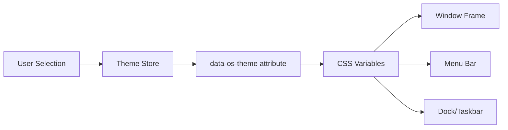
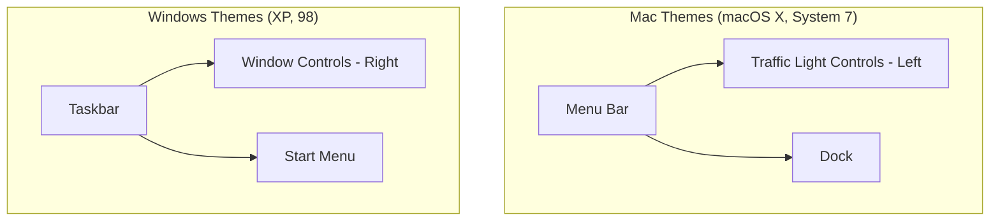

# Theme System

ryOS supports 4 themes emulating classic operating systems.

## Available Themes

| Theme ID | Name | Platform | Key Elements |
|----------|------|----------|--------------|
| `macosx` | Aqua | macOS | Glossy buttons, traffic lights, pinstripe |
| `system7` | System 7 | Classic Mac | Black & white, dotted titlebar |
| `xp` | XP | Windows | Luna blue chrome, rounded corners |
| `win98` | 98 | Windows | 3D face, blue titlebar |

### Theme Application Flow



## Theme Metadata

```typescript
interface ThemeMetadata {
  isWindows: boolean;
  isMac: boolean;
  hasDock: boolean;             // macOS X only
  hasTaskbar: boolean;          // Windows themes
  hasMenuBar: boolean;          // Mac themes
  titleBarControlsPosition: "left" | "right";
  menuBarHeight: number;        // 0, 25, or 30px
  taskbarHeight: number;        // 0 or 30px
  baseDockHeight: number;       // 0 or 56px
}
```

### Platform-Specific UI Components



## CSS Custom Properties

```css
:root[data-os-theme="macosx"] {
  --os-font-ui: "Lucida Grande", ...;
  --os-color-window-bg: white;
  --os-color-titlebar-active-bg: linear-gradient(...);
  --os-metrics-radius: 0.5rem;
  --os-window-shadow: 0 3px 10px rgba(0,0,0,0.3);
}
```
