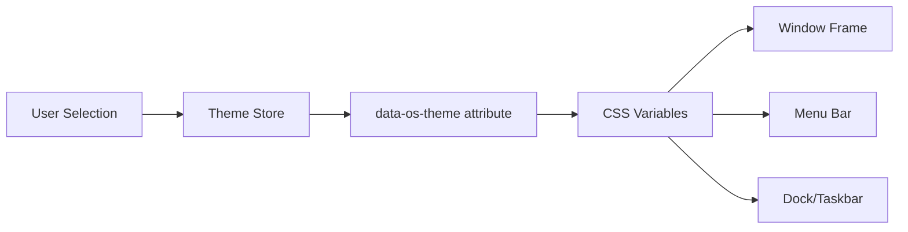
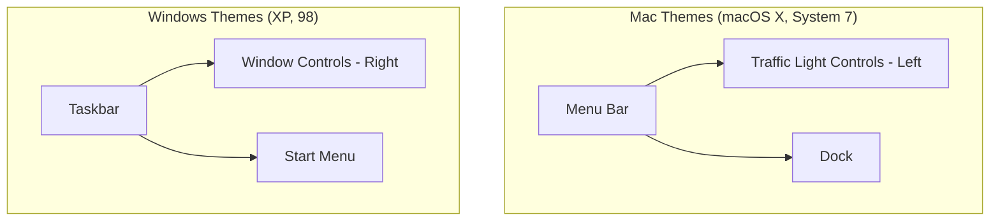

# Theme System

ryOS supports 4 themes emulating classic operating systems.

## Available Themes

| Theme ID | Name | Platform | Key Elements |
|----------|------|----------|--------------|
| `macosx` | Aqua | Mac OS X | Glossy buttons, traffic lights, pinstripe, dock |
| `system7` | System 7 | Classic Mac | Black & white, dotted titlebar pattern |
| `xp` | Luna | Windows XP | Blue chrome, rounded corners, taskbar |
| `win98` | Classic | Windows 98 | 3D beveled face, blue gradient titlebar |

### Theme Application Flow



## Theme Metadata

```typescript
interface ThemeMetadata {
  isWindows: boolean;
  isMac: boolean;
  hasDock: boolean;             // macOS X only
  hasTaskbar: boolean;          // Windows themes
  hasMenuBar: boolean;          // Mac themes
  titleBarControlsPosition: "left" | "right";
  menuBarHeight: number;        // 0, 25, or 30px
  taskbarHeight: number;        // 0 or 30px
  baseDockHeight: number;       // 0 or 56px
}
```

### Platform-Specific UI Components



## CSS Custom Properties

Themes are applied via `data-os-theme` attribute on the document root. CSS custom properties provide consistent styling across components:

```css
:root[data-os-theme="macosx"] {
  --os-font-ui: "LucidaGrande", "Lucida Grande", ...;
  --os-font-mono: Monaco, Menlo, monospace;
  --os-color-window-bg: #ececec;
  --os-color-menubar-bg: linear-gradient(to bottom, #f8f8f8, #d4d4d4);
  --os-color-titlebar-active-bg: linear-gradient(to bottom, #e8e8e8, #d0d0d0);
  --os-color-selection-bg: rgba(39, 101, 202, 0.88);
  --os-metrics-radius: 0.45rem;
  --os-metrics-menubar-height: 25px;
  --os-window-shadow: 0 3px 10px rgba(0,0,0,0.3);
  --os-pinstripe-window: repeating-linear-gradient(...);
}
```

Windows themes (XP, 98) dynamically load additional CSS from `public/css/xp-custom.css` or `public/css/98-custom.css` for legacy widget styling.
