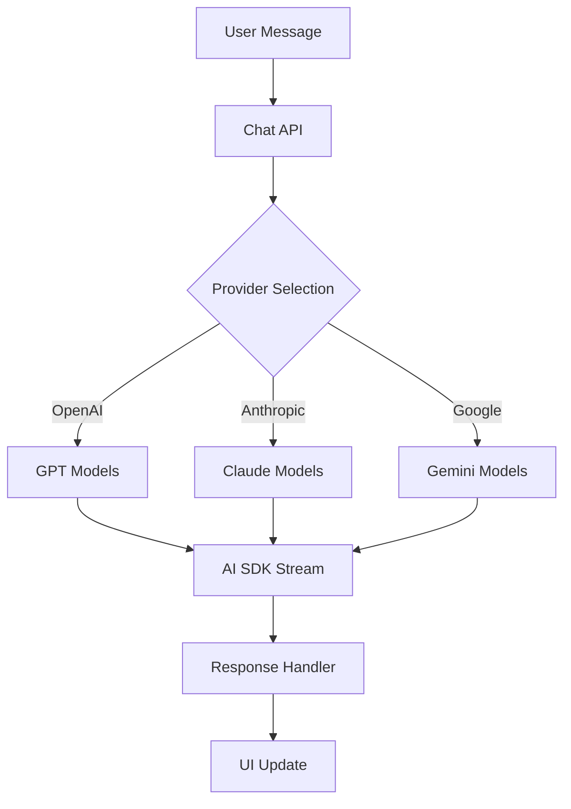
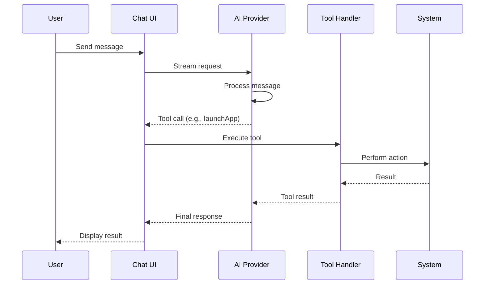

# AI System

Multi-provider AI with tool calling support and streaming responses.

## Providers

| Provider | SDK | Models |
|----------|-----|--------|
| OpenAI | `@ai-sdk/openai` | gpt-5, gpt-5.1, gpt-5-mini, gpt-4o, gpt-4.1, gpt-4.1-mini |
| Anthropic | `@ai-sdk/anthropic` | claude-4.5, claude-4, claude-3.7, claude-3.5 |
| Google | `@ai-sdk/google` | gemini-2.5-pro, gemini-2.5-flash, gemini-3-pro-preview |

Default model: `gpt-5.1`

## Available Tools

| Tool | Description |
|------|-------------|
| `launchApp` | Open applications (with Internet Explorer time-travel support) |
| `closeApp` | Close applications |
| `ipodControl` | Music playback: toggle/play/pause/playKnown/addAndPlay/next/previous, video mode, fullscreen, lyrics translation |
| `karaokeControl` | Karaoke playback (shared library with iPod, independent playback state) |
| `generateHtml` | Create HTML applets with title and emoji icon |
| `aquarium` | Render interactive emoji aquarium in chat |
| `list` | List VFS items: /Applets, /Documents, /Applications, /Music, /Applets Store |
| `open` | Open files/apps from virtual file system |
| `read` | Read file contents (applets, documents, store items) |
| `write` | Create/modify markdown documents (overwrite/append/prepend modes) |
| `edit` | Edit existing files with precise text replacement |
| `searchSongs` | Search YouTube for songs (with API key rotation) |
| `settings` | Change language, theme, volume, speech, check for updates |

## API Endpoints

| Endpoint | Purpose |
|----------|---------|
| [`/api/chat`](/docs/chat-api) | Main chat with streaming and tool calling |
| [`/api/applet-ai`](/docs/ai-generation-apis) | Applet AI assistant and image generation |
| [`/api/ie-generate`](/docs/ai-generation-apis) | Internet Explorer time-travel |
| [`/api/speech`](/docs/media-api) | Text-to-speech synthesis |
| [`/api/audio-transcribe`](/docs/media-api) | Audio transcription |

## Architecture

## Tool Handlers

Tool handlers in `src/apps/chats/tools/` follow a registry pattern:

- `src/apps/chats/tools/appHandlers.ts` - Launch/close app handlers
- `src/apps/chats/tools/ipodHandler.ts` - iPod playback control with iOS detection
- `src/apps/chats/tools/karaokeHandler.ts` - Karaoke playback with fuzzy search
- `src/apps/chats/tools/settingsHandler.ts` - System settings changes
- `src/apps/chats/tools/helpers.ts` - Shared utilities (track formatting, i18n)

## System Prompts

Defined in `api/_utils/_aiPrompts.ts`:

- `CORE_PRIORITY_INSTRUCTIONS` - Persona adherence rules
- `RYO_PERSONA_INSTRUCTIONS` - Ryo's identity and background
- `ANSWER_STYLE_INSTRUCTIONS` - Response style and tone
- `CODE_GENERATION_INSTRUCTIONS` - HTML applet generation rules
- `CHAT_INSTRUCTIONS` - Chat behavior and nudge handling
- `TOOL_USAGE_INSTRUCTIONS` - VFS and tool usage patterns

