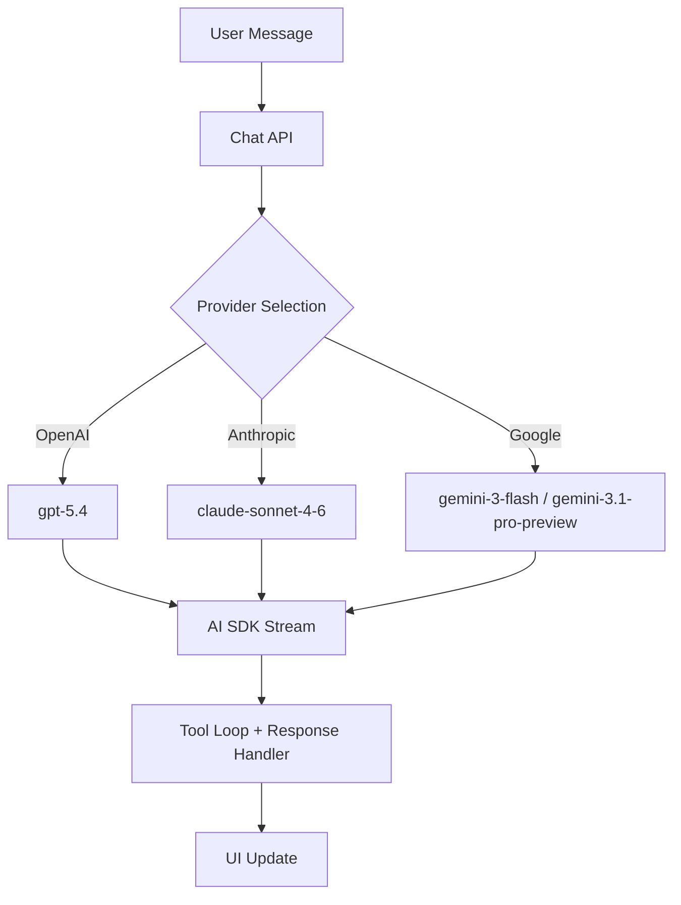
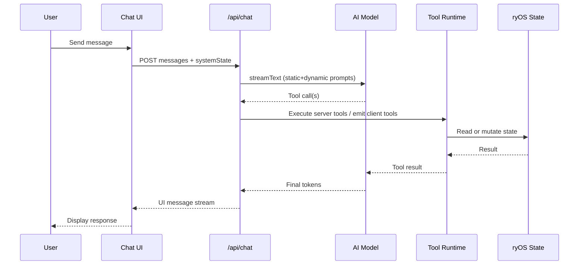

# AI System

Multi-provider AI with streaming responses, tool-loop orchestration, and a two-tier memory pipeline.

## Providers

| Provider | SDK | Models |
|----------|-----|--------|
| OpenAI | `@ai-sdk/openai` | `gpt-5.4` |
| Anthropic | `@ai-sdk/anthropic` | `sonnet-4.6` |
| Google | `@ai-sdk/google` | `gemini-3-flash`, `gemini-3.1-pro-preview` |

Default model: `gpt-5.4`

Specialized models used by specific flows:
- `gemini-2.5-flash` (proactive greeting, applet text mode, chat-room auto replies)
- `gemini-2.5-flash-image` (applet image generation)
- `gemini-2.0-flash` (memory extraction and daily-notes processing)

```mermaid
graph TD
    A[User Message] --> B[Chat API]
    B --> C{Provider Selection}
    C -->|OpenAI| D[gpt-5.4]
    C -->|Anthropic| E[claude-sonnet-4-6]
    C -->|Google| F[gemini-3-flash / gemini-3.1-pro-preview]
    D --> G[AI SDK Stream]
    E --> G
    F --> G
    G --> H[Tool Loop + Response Handler]
    H --> I[UI Update]
```

## Available Tools

| Tool | Description |
|------|-------------|
| `launchApp` | Open applications (supports Internet Explorer URL + year time-travel launch) |
| `closeApp` | Close applications |
| `ipodControl` | iPod playback control: toggle/play/pause/playKnown/addAndPlay/next/previous (+ video/fullscreen/lyrics translation options) |
| `karaokeControl` | Karaoke playback control (shared music library with iPod, independent playback state) |
| `generateHtml` | Create HTML applets with title and emoji icon |
| `aquarium` | Render interactive emoji aquarium in chat |
| `list` | List VFS items: `/Applets`, `/Documents`, `/Applications`, `/Music`, `/Applets Store` |
| `open` | Open files/apps/media from virtual file system |
| `read` | Read file contents (applets, documents, Applets Store items) |
| `write` | Create/modify markdown documents (overwrite/append/prepend modes) |
| `edit` | Edit existing files with precise text replacement |
| `searchSongs` | Search YouTube for songs (with API-key rotation and retry) |
| `settings` | Change language, theme, volume, speech, check-for-updates |
| `stickiesControl` | List/create/update/delete/clear sticky notes |
| `infiniteMacControl` | Control Infinite Mac emulator (launch system, screen read, mouse/keyboard actions, pause state) |
| `memoryWrite` | Unified memory writer (`long_term` or `daily`) |
| `memoryRead` | Unified memory reader (`long_term` by key or `daily` by date) |
| `memoryDelete` | Delete long-term memory by key |

## API Endpoints

| Endpoint | Purpose |
|----------|---------|
| [`/api/chat`](/docs/chat-api) | Main chat with streaming, tool-calling, and context-aware prompt assembly |
| [`/api/ai/extract-memories`](/docs/chat-api) | Single-pass extraction of daily notes + long-term memories from chat history |
| [`/api/ai/process-daily-notes`](/docs/chat-api) | Background processing of past daily notes into long-term memories |
| [`/api/ai/ryo-reply`](/docs/chat-api) | Auto-reply generation for chat rooms |
| [`/api/applet-ai`](/docs/ai-generation-apis) | Applet AI assistant (text + image mode, multimodal input) |
| [`/api/ie-generate`](/docs/ai-generation-apis) | Internet Explorer time-travel page generation |
| [`/api/speech`](/docs/media-api) | Text-to-speech synthesis |
| [`/api/audio-transcribe`](/docs/media-api) | Audio transcription |

## Architecture

```mermaid
sequenceDiagram
    participant U as User
    participant C as Chat UI
    participant API as /api/chat
    participant M as AI Model
    participant T as Tool Runtime
    participant S as ryOS State

    U->>C: Send message
    C->>API: POST messages + systemState
    API->>M: streamText (static+dynamic prompts)
    M-->>API: Tool call(s)
    API->>T: Execute server tools / emit client tools
    T->>S: Read or mutate state
    S-->>T: Result
    T-->>M: Tool result
    M-->>API: Final tokens
    API-->>C: UI message stream
    C-->>U: Display response
```

## Tool Handlers

Backend tool registry lives in `_api/chat/tools/`:

- `_api/chat/tools/types.ts` - Tool constants and TypeScript contracts
- `_api/chat/tools/schemas.ts` - Zod input schemas and action-specific validation
- `_api/chat/tools/executors.ts` - Server-side executors (`generateHtml`, `searchSongs`, memory tools)
- `_api/chat/tools/index.ts` - `createChatTools()` registry (mixes server and client tools)

Client execution handlers remain in `src/apps/chats/tools/`:

- `appHandlers.ts` - Launch/close app execution
- `ipodHandler.ts` / `karaokeHandler.ts` - Media control execution
- `settingsHandler.ts` - System settings updates
- `stickiesHandler.ts` - Sticky note operations
- `infiniteMacHandler.ts` - Infinite Mac control bridge

### Tool schema highlights

- `launchApp` now enforces that `internet-explorer` launches must provide both `url` and `year` together (or neither), with year-range validation.
- `ipodControl` and `karaokeControl` schemas enforce action-specific arguments (e.g. `addAndPlay` requires `id`; playback-state actions must not include track identifiers).
- `memoryWrite` / `memoryRead` are unified schemas using a `type` field:
  - `long_term` (default): key-based memory operations
  - `daily`: journal-style per-day operations
- `infiniteMacControl` supports multimodal screen inspection by returning screen captures that can be converted into model-readable image content.

## System Prompts

Core prompt constants are defined in `_api/_utils/_aiPrompts.ts`:

- `CORE_PRIORITY_INSTRUCTIONS` - Priority and memory-override rules
- `RYO_PERSONA_INSTRUCTIONS` - Ryo identity and background
- `ANSWER_STYLE_INSTRUCTIONS` - Style and language behavior
- `CODE_GENERATION_INSTRUCTIONS` - Applet generation constraints
- `CHAT_INSTRUCTIONS` - Chats behavior and memory usage guidance
- `TOOL_USAGE_INSTRUCTIONS` - VFS and tool workflow rules
- `MEMORY_INSTRUCTIONS` - Two-tier memory strategy and tool usage policy
- `IE_HTML_GENERATION_INSTRUCTIONS` - Internet Explorer HTML generation rules

Endpoint-specific prompts:
- `/api/chat` composes a static system prompt from the core constants, then appends dynamic user/system state.
- `/api/applet-ai` uses a dedicated compact applet system prompt for embedded UI contexts.
- `/api/ie-generate` splits prompts into static + dynamic sections for year/URL-aware generation.

## Memory System

ryOS uses a two-tier Redis-backed memory model:

### Tier 1: Daily Notes (journal memory)

- Append-only entries grouped by date (`YYYY-MM-DD`) in user timezone.
- Each entry stores:
  - Unix timestamp (`timestamp`)
  - UTC ISO timestamp (`isoTimestamp`)
  - Local date/time (`localDate`, `localTime`)
  - Timezone (`timeZone`)
  - Entry content
- Daily notes auto-expire after 30 days (TTL).
- Recent notes from the last 3 days are injected into chat prompt context.

### Tier 2: Long-Term Memories

- Two-layer structure:
  - Index: key + summary + `updatedAt` (always visible to the model)
  - Detail: full content + `createdAt` + `updatedAt`
- Capped at 50 memories per user.
- Canonical key guidance (e.g. `name`, `preferences`, `projects`, `instructions`) is used by extraction pipelines.

### Stale-memory cleanup

- Long-term hygiene includes automatic cleanup of stale temporary memories.
- Temporary context-like memories (e.g. short-lived travel/meeting context) are removed when old enough (default retention: 7 days) and heuristics identify them as transient.
- Cleanup runs as part of the daily-notes processing cycle before new extraction.

## Daily Notes Processing Pipeline

```mermaid
flowchart TD
    A[Conversation / tool writes] --> B[/api/ai/extract-memories]
    B --> C[Append daily notes + optional long-term updates]
    C --> D[Unprocessed daily notes accumulate]
    D --> E[/api/chat proactive greeting trigger]
    E --> F[/api/ai/process-daily-notes]
    F --> G[Cleanup stale temporary memories]
    G --> H[Process past days only, oldest first]
    H --> I[Extract + consolidate long-term memories]
    I --> J[Mark daily note processed]
```

Pipeline behavior:
1. `extract-memories` performs single-pass extraction from chat history (daily notes + candidate long-term facts).
2. Daily notes continue collecting while a day is active.
3. `process-daily-notes` processes unprocessed past days (excludes today), consolidates overlaps, and marks each processed day.
4. Chat endpoint can trigger `process-daily-notes` in the background during proactive greeting flow.

## apiHandler Pattern

AI endpoints use a shared `_api/_utils/api-handler.ts` wrapper for consistency:

- CORS and allowed-origin checks
- Method gating + automatic `OPTIONS` handling
- Optional JSON body parsing
- Shared per-request context injection (`req`, `res`, `redis`, `logger`, `origin`, `user`, `body`)
- Unified auth modes (`none`, `optional`, `required`) with optional expired-token allowance
- Unified top-level error handling and status logging

Common endpoint configurations in this AI stack:

- `/api/chat`: `auth: "optional"`, `allowExpiredAuth: true`, `parseJsonBody: true`, `contentType: null`
- `/api/applet-ai`: `auth: "optional"`, `parseJsonBody: true`, `contentType: null`
- `/api/ie-generate`: `auth: "none"`, `parseJsonBody: true`, `contentType: null`
- `/api/ai/extract-memories`: `auth: "required"`, `parseJsonBody: true`
- `/api/ai/process-daily-notes`: `auth: "required"`, `parseJsonBody: true`
- `/api/ai/ryo-reply`: `auth: "required"`, `parseJsonBody: true`

## Additional AI Capabilities

- **Proactive greetings**: `/api/chat` supports a non-streaming proactive greeting mode that uses memory context and can kick off background daily-note processing.
- **Chat-room auto replies**: `/api/ai/ryo-reply` generates room messages as `ryo` with dedicated rate limits.
- **Applet multimodal AI**: `/api/applet-ai` supports text chat, image attachments in message history, and binary image generation responses.
- **Infinite Mac visual loop**: `infiniteMacControl` can return screenshots for model-visible state inspection.
- **Internet Explorer caching**: `/api/ie-generate` stores cleaned generated HTML snapshots in Redis for recent-history retrieval.

