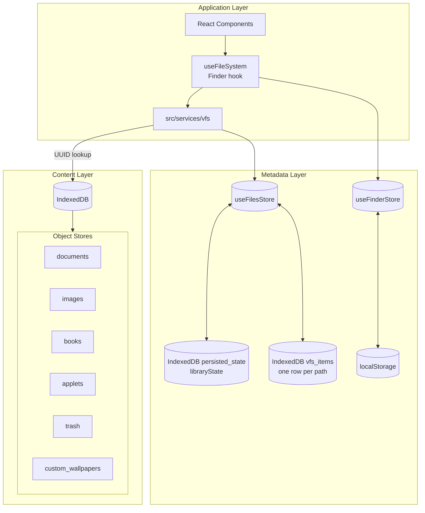
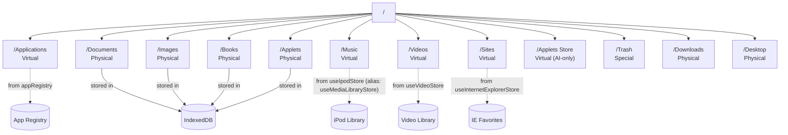

# File System

Browser-based hierarchical virtual file system with metadata/content separation and a VFS service facade for cross-app access.

## Two-Layer Architecture

- **Metadata Layer** (Zustand + IndexedDB): File paths, names, types, UUIDs, timestamps, and status
- **Content Layer** (IndexedDB): Actual file content indexed by UUID for efficient storage
- **VFS Service Layer** (`src/services/vfs/`): Metadata/content repositories, virtual trees, and cross-app file operations



## Key Stores

| Store | Purpose | Persistence |
|-------|---------|-------------|
| `useFilesStore` | File/folder metadata, paths, UUIDs, status | IndexedDB (`vfs_items`, with lifecycle metadata in `persisted_state`) |
| `useFinderStore` | Finder window instances, navigation history, view preferences | localStorage |
| IndexedDB | File content (text, images, applets) | Browser storage |

## VFS Service Layer

`src/services/vfs/` provides cross-app access to Finder-backed file data:

| Module | Purpose |
|--------|---------|
| `FileMetadataService` | Metadata lookups backed by `useFilesStore` |
| `FileContentRepository` | IndexedDB read/write by path or UUID |
| `pathPolicy` | Writable-path rules, protected system roots, root-folder name validation, and save-location directory listing |
| `virtualTrees` | Virtual `/Music` and `/Videos` directory builders |
| `useVfsFileOperations` | Thin cross-app wrapper for file writes |

## Directory Structure

| Path | Type | Description |
|------|------|-------------|
| `/` | Root | Root directory |
| `/Applications` | Virtual | Apps from registry (non-Finder apps) |
| `/Documents` | Physical | User text documents (.txt, .md) |
| `/Images` | Physical | User images (PNG, JPG, GIF, WebP, BMP) |
| `/Books` | Physical | EPUB books (content stored in IndexedDB; ships with a default Meditations book) |
| `/Music` | Virtual | iPod library (organized by artist) |
| `/Videos` | Virtual | Video library (organized by artist) |
| `/Sites` | Virtual | Internet Explorer favorites |
| `/Applets` | Physical | HTML applets (.app, .html files) |
| `/Applets Store` | Virtual (AI-only) | Shared applets catalog from Redis/API; visible to Chats `list`/`read`/`open` tools, not a Finder folder |
| `/Trash` | Special | Deleted items (restorable) |
| `/Downloads` | Physical | User downloads (AirDrop and similar) |
| `/Desktop` | Physical | Shortcuts and aliases |
| `/{name}` | Physical (user) | User-created root folders (e.g. `/MyStuff`); fully writable, renamable, and trashable |

### Path Policy

Root-level folders fall into three categories (see `src/services/vfs/pathPolicy.ts`):

| Category | Examples | Writable inside? | Rename / trash root? |
|----------|----------|------------------|----------------------|
| Virtual roots | `/Applications`, `/Music`, `/Videos`, `/Sites` | No | No (not in metadata) |
| System roots | `/Documents`, `/Images`, `/Books`, `/Downloads`, `/Applets`, `/Trash`, `/Desktop` | Yes for `/Documents`, `/Images`, `/Books`, `/Downloads` (and their subtrees); `/Applets` is import-only | No |
| User roots | Any folder created at `/` (e.g. `/Projects`) | Yes (full subtree) | Yes |

Users can create new root-level folders from Finder at `/` (File → New Folder). Names must not collide (case-insensitively) with system or virtual root names. System-managed root folders cannot be renamed or moved to Trash; user-created root folders can.

Writable paths include `/` (for new root folders and root-level files), writable system subtrees, and any user root subtree. Virtual roots, `/Trash`, `/Desktop`, and `/Applets` are not general-purpose write targets.

### Save Anywhere

Apps that save user files (TextEdit, Paint, Preview, and similar) use `SaveFileDialog`, which lists all writable directories depth-first via `listWritableDirectories()` — system folders plus user-created folders. Files can be saved to any writable path, not only the default folders.

Content IndexedDB routing (`getStoreForFile` in `src/utils/indexedDBOperations.ts`):

- Fixed prefixes: `/Documents/*` → `documents`, `/Images/*` → `images`, `/Books/*` → `books`, `/Applets/*` → `applets`
- Everything else under a writable path (including `/Downloads`, user root folders, and root-level files) routes by file extension/type to the same stores (e.g. `/MyStuff/photo.png` → `images`, `/MyStuff/notes.md` → `documents`). Routing depends only on the filename so cloud sync resolves identically on every device.



## File Metadata

```typescript
interface FileSystemItem {
  // Core properties
  path: string;           // Full path, unique identifier (e.g., "/Documents/note.md")
  name: string;           // File/folder name
  isDirectory: boolean;
  type?: string;          // File type (markdown, text, png, jpg, html, etc.)
  icon?: string;          // Icon path or emoji
  appId?: string;         // Associated application ID
  
  // Content reference
  uuid?: string;          // UUID for IndexedDB content lookup (files only)
  
  // File properties
  size?: number;          // File size in bytes
  createdAt?: number;     // Creation timestamp
  modifiedAt?: number;    // Last modified timestamp
  
  // Status
  status: "active" | "trashed";
  originalPath?: string;  // Path before moving to trash
  deletedAt?: number;     // When moved to trash
  
  // Applet sharing
  shareId?: string;       // Share ID for shared applets (from Redis)
  createdBy?: string;     // Creator username
  storeCreatedAt?: number;
  
  // Window dimensions
  windowWidth?: number;
  windowHeight?: number;
  
  // Alias/shortcut properties
  aliasTarget?: string;   // Target path or appId
  aliasType?: "file" | "app";
  hiddenOnThemes?: OsThemeId[];  // Hide on specific OS themes
}
```

## IndexedDB Storage

Database: `ryOS` (version 14)

| Object Store | Content Type | Key |
|--------------|--------------|-----|
| `documents` | Text files (strings) | UUID |
| `images` | Binary images (Blobs) | UUID |
| `books` | EPUB book files (Blobs) | UUID |
| `book_thumbnails` | Generated book cover thumbnails | UUID |
| `applets` | HTML applet content | UUID |
| `trash` | Deleted file content | UUID |
| `custom_wallpapers` | User wallpapers | UUID |
| `apple_music_library` | Apple Music library cache | Apple Music ID |
| `apple_music_playlists` | Apple Music playlist cache | Playlist ID |
| `apple_music_playlist_tracks` | Apple Music playlist track cache | Playlist ID |
| `vfs_items` | File/folder metadata (`FileSystemItem`) | Full path |
| `persisted_state` | Zustand scalar metadata and unsplit snapshots | `ryos:*` persist key |

Content structure stored in IndexedDB:
```typescript
interface StoredContent {
  name: string;               // Original filename
  content: string | Blob;     // File content
}
```

## CRUD Operations

### File Operations

```typescript
// Finder's useFileSystem hook provides these operations.
// Other apps use src/services/vfs/useVfsFileOperations or store APIs directly.
const {
  // Navigation
  currentPath,
  navigateToPath,
  navigateUp,
  navigateBack,
  navigateForward,
  
  // File listing
  files,
  isLoading,
  error,
  
  // Selection (supports multi-select with Ctrl/Cmd+click and Shift+click)
  selectedFiles,
  selectionAnchorPath,
  handleFileSelect,
  handleFileOpen,
  
  // File operations
  saveFile,        // Create or update file
  renameFile,      // Rename file/folder
  createFolder,    // Create new folder
  moveFile,        // Move file to different folder
  
  // Trash operations
  moveToTrash,
  restoreFromTrash,
  emptyTrash,
  trashItemsCount,
  
  // System
  formatFileSystem,  // Reset entire filesystem
} = useFileSystem(initialPath, options);
```

### Save File Example
```typescript
// Any writable path works — not limited to /Documents
await saveFile({
  path: "/MyStuff/note.md",
  name: "note.md",
  content: "# My Note\nContent here",
  type: "markdown",
  icon: "/icons/file-text.png",
});
```

Cross-app Save As flows pick the directory via `SaveFileDialog` (`src/components/dialogs/SaveFileDialog.tsx`), which offers every writable folder in the VFS.

### Move to Trash Flow
1. Mark item as `status: "trashed"` in metadata
2. Store `originalPath` and `deletedAt` timestamp
3. For files with IndexedDB content (any writable path — documents, images, books, applets), move content from the source store to the `trash` store
4. Update Trash folder icon (`trash-full.png`)

System-managed root folders and virtual items cannot be moved to Trash; user-created root folders can.

### Restore from Trash Flow
1. Reset `status` to `"active"`, clear `originalPath` and `deletedAt`
2. For files with IndexedDB content, move content back from the `trash` store to the store resolved for `originalPath` (extension-based routing applies)
3. Update Trash folder icon if empty

## Lazy Loading

Default file content is lazy-loaded on first access:

```typescript
// Register files for lazy loading during initialization
registerFilesForLazyLoad(files, items);

// Load content when file is opened
await ensureFileContentLoaded(filePath, uuid);
```

Files with `assetPath` in `public/data/filesystem.json` are fetched on-demand, not during app initialization. This improves startup performance.

`preloadFileSystemData()` starts fetching `filesystem.json` and `applets.json` during bootstrap so metadata is warm before Finder mounts, while binary file assets still load on first open.

## Finder App Integration

### Multi-Window Support

Each Finder window is an instance with its own state:

```typescript
interface FinderInstance {
  instanceId: string;
  currentPath: string;
  navigationHistory: string[];
  navigationIndex: number;
  viewType: ViewType;        // "small" | "large" | "list"
  sortType: SortType;        // "name" | "date" | "size" | "kind"
  selectedFile: string | null; // Legacy single-select field
  selectedFiles: string[];   // Multi-select support
  selectionAnchorPath: string | null;  // Anchor for range selection
}
```

### Undo/Redo for File Operations

Finder maintains a per-instance undo/redo stack for file operations:

```typescript
type FinderUndoAction =
  | { type: "moveToTrash"; fileName: string; originalPath: string }
  | { type: "rename"; basePath: string; oldName: string; newName: string };
```

Supported undo/redo actions:
- **Move to Trash**: Undo restores the trashed item; redo re-trashes it
- **Rename**: Undo reverts to the old name; redo reapplies the new name

The stack is capped at 20 entries. Any new action clears the redo stack.

### Reactive File View

Finder automatically refreshes when the file store's `items` reference changes (e.g., after move-to-trash, restore, empty-trash, or cloud sync). This is achieved via a Zustand `subscribe()` call that triggers `loadFiles()` whenever `state.items` changes. Cloud sync updates for images are also detected through `useCloudSyncStore` subscription.

### Sorting with Localized Names

Finder sorts items using locale-aware comparison via `compareFinderItemsByDisplayName()` and `compareFinderSortText()` from `src/utils/finderDisplay.ts`. These utilities use `Intl.Collator` with the current UI language so that translated folder names (e.g., Japanese, Korean) sort correctly alongside Latin names.

### View Type Preferences

Per-path view type preferences persist across sessions:

```typescript
// useFinderStore.getDefaultViewTypeForPath(path)
//   Returns default path-specific view types.
// useFinderStore.getViewTypeForPath(path)
//   Returns a persisted per-path preference or the default.
```

### File Type Detection

```typescript
function getFileTypeFromExtension(fileName: string): string {
  const ext = fileName.split(".").pop()?.toLowerCase();
  switch (ext) {
    case "md": return "markdown";
    case "txt": return "text";
    case "png": case "gif": case "webp": case "bmp": return ext;
    case "jpg": case "jpeg": return "jpg";
    case "html": case "htm": return "html";
    case "app": return "application";
    default: return "unknown";
  }
}
```

## Supported File Types

Paths under `/Documents`, `/Images`, `/Books`, and `/Applets` use fixed store prefixes. The same extensions in other writable locations (user root folders, `/Downloads`, or root-level files) route to the matching IndexedDB store by extension.

| Extension | Type | Opens With | Storage |
|-----------|------|------------|---------|
| `.md` | Markdown | TextEdit | IndexedDB (documents) |
| `.txt` | Plain text | TextEdit | IndexedDB (documents) |
| `.png`, `.jpg`, `.jpeg`, `.gif`, `.webp`, `.bmp` | Image | Paint | IndexedDB (images) |
| `.epub` | EPUB book | Books | IndexedDB (books) |
| `.app`, `.html` | HTML Applet | Applet Viewer | IndexedDB (applets) |
| `.mp3` | Audio | iPod | Virtual (iPod store) |
| `.mov` | Video | Videos | Virtual (Video store) |
| `.webloc` | Web link | Internet Explorer | Virtual (IE store) |

## Desktop Shortcuts

Aliases/shortcuts on Desktop:

```typescript
// Create alias from context menu or drag
fileStore.createAlias(
  targetPath,      // Original file path or app ID
  aliasName,       // Display name
  aliasType,       // "file" | "app"
  targetAppId      // For app shortcuts
);
```

Desktop shortcuts support:
- App shortcuts (launches the app)
- File shortcuts (opens the target file)
- Theme-specific visibility (`hiddenOnThemes`)

## Cloud Sync

The cloud sync system (Cloud Sync v2, `/api/sync/v2/*`) persists file metadata and content (documents, images, applets, trash) across devices as a per-user key → document map. It also syncs **calendar** events, **contacts**, **stickies**, **songs**, **videos**, **custom wallpapers**, and **settings** from their respective stores, enabling backup and real-time sync via Pusher or local WebSocket.

### Per-Key Documents

The files codec (`src/sync/codecs.ts`) decomposes file state into per-key documents:

| Key | Contents |
|-----|----------|
| `files/item:{path}` | File/folder metadata (`FileSystemItem`) |
| `files/doc:{uuid}` | TextEdit document contents (from IndexedDB `documents`) |
| `images/item:{key}`, `trash/item:{key}`, `applets/item:{key}`, `wallpapers/item:{key}` | Binary content references; the bytes are content-addressed blobs in object storage (`sync/{username}/blobs/{sha256}.gz`), uploaded and deduped by sha256 via a batched `POST /api/sync/v2/blobs` |

### Deletions

When items are deleted (trash, empty trash, etc.), the sync engine uploads tombstone ops for the affected keys. Deletions are inferred from shadow-map keys that are missing locally, corroborated by deletion markers (path/id → timestamp) kept in `useCloudSyncStore`. This enables correct handling of deletes across devices and safe recreation of items after deletion.

### Conflict Resolution

Conflict resolution is per-key last-writer-wins using hybrid-logical-clock (HLC) timestamps. There are no snapshot merges or 409 conflicts; the newest write for each key wins.

### Shadow-Diff Change Tracking

The sync engine (`src/sync/engine.ts`) subscribes to the file stores and keeps a persisted shadow map (key → HLC timestamp + content hash). Pending uploads are derived as diff(local state, shadow) and flushed with a ~1s debounce, so individual file operations (save, rename, move, trash, restore) sync incrementally as per-key ops rather than full-store uploads.

## Migration System

Store version migrations handle schema changes:

```typescript
// useFilesStore persist version history (current: 14)
// v5: Added UUID-based content keys
// v6: Added timestamps (createdAt, modifiedAt)
// v7: Added file size tracking
// v8: No shape change; cloud sync on rehydrate
// v11: Expand legacy macosx-only hiddenOnThemes desktop shortcuts
// v12: Migrate default desktop shortcuts
// v13: Add prominent System 7 desktop app shortcuts
// v14: Add the default Meditations EPUB to /Books
```

## Events

File system changes emit custom events:

```typescript
// File saved/updated
window.dispatchEvent(new CustomEvent("fileUpdated", {
  detail: { name, path }
}));

// File renamed
window.dispatchEvent(new CustomEvent("fileRenamed", {
  detail: { oldPath, newPath, oldName, newName }
}));

// File saved (for applets)
window.dispatchEvent(new CustomEvent("saveFile", {
  detail: { name, path, content, icon }
}));
```
