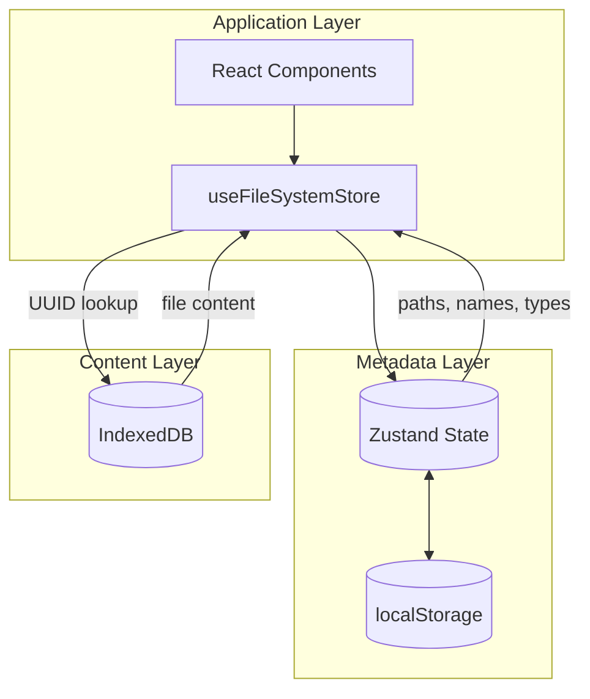
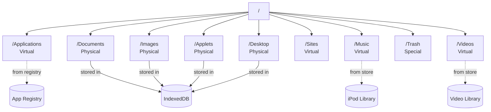

# File System

Browser-based hierarchical file system.

## Two-Layer Architecture

- **Metadata Layer** (Zustand + localStorage): paths, names, types, UUIDs
- **Content Layer** (IndexedDB): actual file content indexed by UUID



## Directory Structure

| Path | Type | Description |
|------|------|-------------|
| `/` | Root | Root directory |
| `/Applications` | Virtual | Apps from registry |
| `/Documents` | Physical | User documents |
| `/Images` | Physical | User images |
| `/Music` | Virtual | iPod library |
| `/Videos` | Virtual | Video library |
| `/Sites` | Virtual | IE favorites |
| `/Applets` | Physical | HTML applets |
| `/Trash` | Special | Deleted items |
| `/Desktop` | Physical | Shortcuts |



## File Metadata

```typescript
interface FileSystemItem {
  path: string;        // Unique identifier
  name: string;
  isDirectory: boolean;
  type?: string;       // markdown, text, png, etc.
  uuid?: string;       // Content storage key
  size?: number;
  createdAt?: number;
  modifiedAt?: number;
  status: "active" | "trashed";
  aliasTarget?: string;  // For shortcuts
}
```
