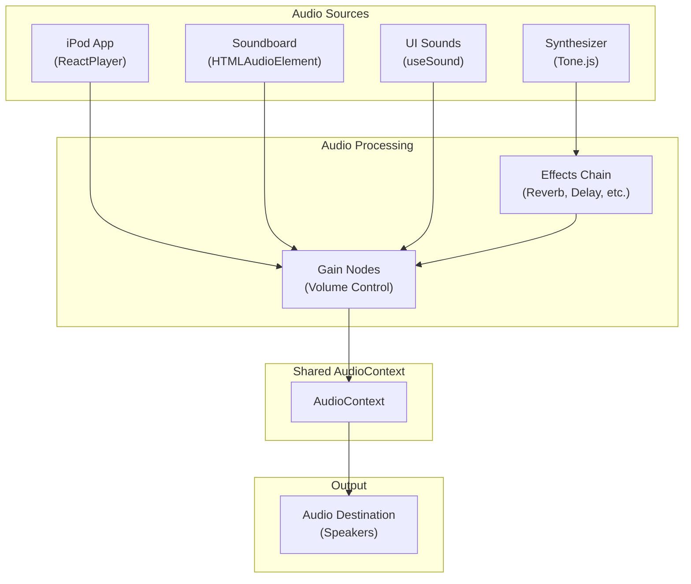
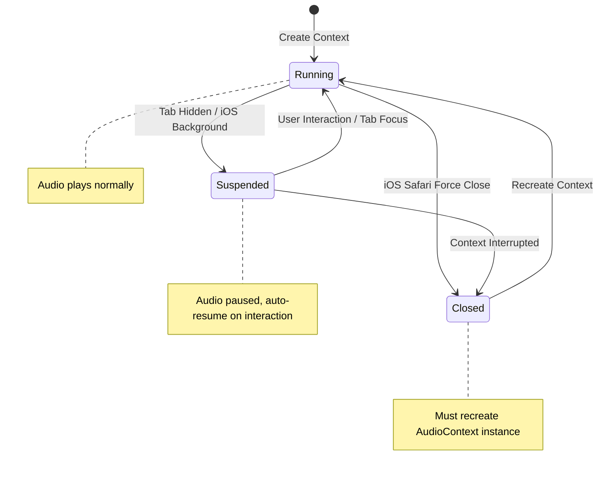

# Audio System

Overview of ryOS audio capabilities and architecture.

## Technologies

| Technology | Usage |
|------------|-------|
| Web Audio API | Core audio processing, centralized AudioContext management, UI sound playback |
| Tone.js | Synthesizer app with polyphonic synthesis, effects chain, and real-time audio generation |
| WaveSurfer.js | Waveform visualization for recorded sounds in Soundboard app |
| MediaRecorder API | Audio recording functionality for Soundboard app |
| ReactPlayer | YouTube video/audio playback in iPod app |

## Architecture Overview

## Audio Playback

ryOS provides multiple audio playback mechanisms:

- **iPod App**: Uses ReactPlayer for YouTube video/audio playback with volume control, seeking, and playback state management. Supports fullscreen playback with synchronized lyrics display.

- **Soundboard App**: Plays recorded audio clips using HTMLAudioElement. Supports multiple audio formats (WebM, MP4, WAV, MPEG) with base64-encoded storage. Includes waveform visualization using WaveSurfer.js.

- **UI Sounds**: The `useSound` hook provides Web Audio API-based playback for interface feedback sounds (window operations, button clicks, menu interactions). Features include:
  - AudioBuffer caching for performance
  - Concurrent source limiting (16 on mobile, 32 on desktop)
  - Volume control with master and UI volume multipliers
  - Fade in/out capabilities
  - Automatic AudioContext resumption

## Synthesizer

The Synthesizer app (`src/apps/synth/`) provides a full-featured music synthesizer built with Tone.js:

- **Oscillators**: Supports sine, square, triangle, and sawtooth waveforms
- **Polyphonic Synthesis**: Tone.PolySynth enables multiple simultaneous notes
- **Effects Chain**: 
  - Reverb (decay, wet mix)
  - Feedback Delay
  - Distortion
  - Chorus
  - Phaser
  - BitCrusher
  - Gain control
- **ADSR Envelope**: Attack, Decay, Sustain, Release controls for note shaping
- **Preset System**: Save and load custom synthesizer configurations
- **Keyboard Support**: Virtual piano keyboard with octave shifting, keyboard mapping, and touch/mouse support
- **Visualization**: 3D waveform visualization using Tone.Analyser

The synthesizer uses a simplified effects chain on mobile Safari to avoid audio blocking issues, while desktop uses the full effects chain.

## Sound Recording

The Soundboard app (`src/apps/soundboard/`) provides audio recording capabilities:

- **MediaRecorder API**: Records audio from user's microphone
- **Format Support**: Automatically detects and uses browser-supported formats (WebM for Chrome/Firefox, MP4 for Safari)
- **Device Selection**: Supports selecting specific audio input devices
- **Base64 Storage**: Recorded audio is stored as base64-encoded data in the app's state
- **Waveform Visualization**: Uses WaveSurfer.js to display audio waveforms for recorded clips
- **Recording State Management**: Tracks recording state per sound slot with visual feedback

The `useAudioRecorder` hook manages recording lifecycle, permission handling, and format conversion.

## Audio Settings

Audio settings are managed centrally via `useAudioSettingsStore`:

- **Volume Controls**:
  - Master volume (global multiplier)
  - UI volume (interface sounds)
  - Chat synth volume (text-to-speech synthesis)
  - Speech volume (voice input/output)
  - iPod volume (music player)

- **Feature Toggles**:
  - UI sounds enabled/disabled
  - Terminal sounds enabled/disabled
  - Typing synthesis enabled/disabled
  - Speech enabled/disabled
  - Keep talking mode

- **TTS Settings**:
  - TTS model selection (OpenAI, ElevenLabs, or null)
  - Voice selection
  - Synthesizer preset

All settings are persisted to localStorage via Zustand's persist middleware.

## Audio Context Management

The audio system uses a centralized AudioContext (`src/lib/audioContext.ts`) to:

- **Single Context**: Maintains one shared AudioContext instance across the application
- **Auto-Resume**: Automatically resumes suspended contexts on user interaction, tab focus, or device changes
- **Context Recreation**: Recreates closed contexts (e.g., after iOS Safari backgrounding)
- **State Management**: Tracks context state and notifies listeners of context changes
- **Mobile Optimization**: Handles iOS Safari quirks including suspended/interrupted states

This centralized approach prevents AudioContext limit issues and ensures consistent audio behavior across all apps.
