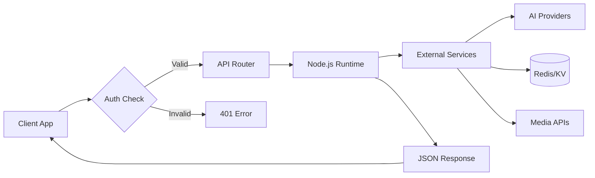
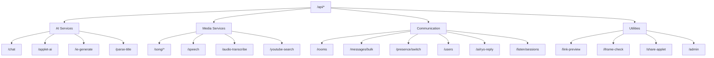

# API Reference

ryOS uses Vercel Serverless Functions with Node.js runtime for all backend APIs.

## API Request Flow



## Endpoint Documentation

| Endpoint Group | Description |
|----------------|-------------|
| [Chat API](/docs/chat-api) | Main AI chat with streaming and tool calling |
| [Song API](/docs/song-api) | Music library CRUD, lyrics, furigana, translations |
| [Media API](/docs/media-api) | Text-to-speech, transcription, YouTube search |
| [Auth API](/docs/auth-api) | User registration, login, token management |
| [Rooms API](/docs/rooms-api) | Chat room creation and management |
| [Messages API](/docs/messages-api) | Send and retrieve chat messages |
| [Presence API](/docs/presence-api) | Presence tracking, user search, AI replies |
| [AI Generation APIs](/docs/ai-generation-apis) | Applet generation, IE time-travel, parse-title |
| [Utility APIs](/docs/utility-apis) | Link preview, iframe check, share applet, admin |
| [API Design Guide](/docs/api-design-guide) | Patterns and conventions for API development |

## Quick Reference

### AI Endpoints

| Endpoint | Purpose |
|----------|---------|
| `/api/chat` | Main AI chat with tool calling |
| `/api/applet-ai` | Applet text + image generation |
| `/api/ie-generate` | Time-travel page generation |
| `/api/parse-title` | Music metadata extraction |

### Media Endpoints

| Endpoint | Purpose |
|----------|---------|
| `/api/songs/` | Song library CRUD |
| `/api/songs/[id]` | Individual song operations |
| `/api/speech` | Text-to-speech |
| `/api/audio-transcribe` | Speech-to-text |
| `/api/youtube-search` | YouTube music search |

### Communication Endpoints

| Endpoint | Purpose |
|----------|---------|
| `/api/rooms` | Room list + create |
| `/api/rooms/[id]` | Room detail + delete |
| `/api/rooms/[id]/join` | Join a room |
| `/api/rooms/[id]/leave` | Leave a room |
| `/api/rooms/[id]/users` | Get active users in room |
| `/api/rooms/[id]/messages` | List/send messages |
| `/api/rooms/[id]/messages/[msgId]` | Delete message (admin) |
| `/api/messages/bulk` | Bulk message fetch |
| `/api/presence/switch` | Presence switching |
| `/api/users` | User search |
| `/api/ai/ryo-reply` | AI reply in rooms |
| `/api/listen/sessions` | List/create listen-together sessions |
| `/api/listen/sessions/[id]` | Get session state |
| `/api/listen/sessions/[id]/join` | Join listen session |
| `/api/listen/sessions/[id]/leave` | Leave listen session |
| `/api/listen/sessions/[id]/sync` | Sync playback state (DJ only) |
| `/api/listen/sessions/[id]/reaction` | Send emoji reaction |

### Utility Endpoints

| Endpoint | Purpose |
|----------|---------|
| `/api/link-preview` | URL metadata extraction |
| `/api/iframe-check` | Embeddability checking |
| `/api/share-applet` | Applet sharing |
| `/api/admin` | Admin operations |

### Endpoint Categories Overview



## Authentication

```
Authorization: Bearer {token}
X-Username: {username}
```

Token-based with 90-day expiration.

## AI Providers

| Provider | Models |
|----------|--------|
| OpenAI | gpt-5, gpt-5.1, gpt-5-mini, gpt-4o, gpt-4.1, gpt-4.1-mini |
| Anthropic | claude-4.5, claude-4, claude-3.7, claude-3.5 |
| Google | gemini-2.5-pro, gemini-2.5-flash, gemini-3-pro-preview |
