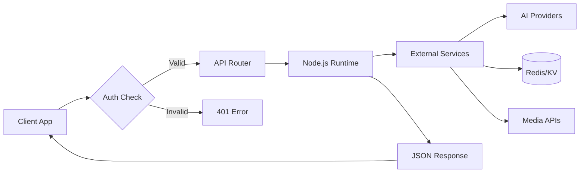
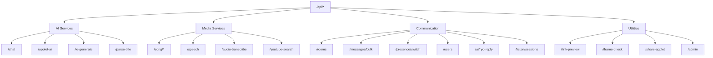

# API Reference

ryOS backend APIs use Node.js route handlers in `_api/`, deployable on Vercel or the standalone Bun API server.

Most actively refactored JSON routes use the shared `apiHandler` utility (`_api/_utils/api-handler.ts`) for CORS, method checks, auth resolution, and consistent error handling. Some specialized routes (for example multipart upload handlers) still use explicit/manual handling.

## API Request Flow


```mermaid
graph LR
    Client[Client App] --> Auth{Auth Check}
    Auth -->|Valid| Router[API Router]
    Auth -->|Invalid| Error[401 Error]
    Router --> API[Node.js Runtime]
    API --> Services[External Services]
    Services --> AI[AI Providers]
    Services --> DB[(Redis/KV)]
    Services --> Media[Media APIs]
    API --> Response[JSON Response]
    Response --> Client
```

## Endpoint Documentation

| Endpoint Group | Description |
|----------------|-------------|
| [Chat API](/docs/chat-api) | Main AI chat with streaming and tool calling |
| [Song API](/docs/song-api) | Music library CRUD, lyrics, furigana, translations |
| [Media API](/docs/media-api) | Text-to-speech, transcription, YouTube search |
| [Auth API](/docs/auth-api) | User registration, login, token management |
| [Rooms API](/docs/rooms-api) | Chat room creation and management |
| [Messages API](/docs/messages-api) | Send and retrieve chat messages |
| [Presence API](/docs/presence-api) | Presence tracking, user search, AI replies |
| [AI Generation APIs](/docs/ai-generation-apis) | Applet generation, IE time-travel, parse-title |
| [Utility APIs](/docs/utility-apis) | Link preview, iframe check, share applet, admin |
| [API Design Guide](/docs/api-design-guide) | Patterns and conventions for API development |

## Cross-Cutting Handler Pattern

- **`apiHandler`**: shared wrapper for CORS preflight, origin checks, method allowlists, optional JSON parsing, unified logger wiring, and default JSON error handling.
- **`request-auth`**: shared auth resolver for token endpoints, expecting:
  - `Authorization: Bearer {token}`
  - `X-Username: {username}`
- **Partial auth headers** return `400`.
- **Invalid token/username pairs** return `401`.
- **Optional-auth endpoints** can be anonymous while still validating provided auth headers.

## Quick Reference

### AI Endpoints

| Endpoint | Purpose |
|----------|---------|
| `/api/chat` | Main AI chat with tool calling |
| `/api/applet-ai` | Applet text + image generation |
| `/api/ie-generate` | Time-travel page generation |
| `/api/parse-title` | Music metadata extraction |

### Media Endpoints

| Endpoint | Purpose |
|----------|---------|
| `/api/songs/` | Song library CRUD |
| `/api/songs/[id]` | Individual song operations |
| `/api/speech` | Text-to-speech |
| `/api/audio-transcribe` | Speech-to-text |
| `/api/youtube-search` | YouTube music search |

### Communication Endpoints

| Endpoint | Purpose |
|----------|---------|
| `/api/rooms` | Room list + create |
| `/api/rooms/[id]` | Room detail + delete |
| `/api/rooms/[id]/join` | Join a room |
| `/api/rooms/[id]/leave` | Leave a room |
| `/api/rooms/[id]/users` | Get active users in room |
| `/api/rooms/[id]/messages` | List/send messages |
| `/api/rooms/[id]/messages/[msgId]` | Delete message (admin) |
| `/api/messages/bulk` | Bulk message fetch |
| `/api/presence/switch` | Presence switching |
| `/api/users` | User search |
| `/api/ai/ryo-reply` | AI reply in rooms |
| `/api/listen/sessions` | List/create listen-together sessions |
| `/api/listen/sessions/[id]` | Get session state |
| `/api/listen/sessions/[id]/join` | Join listen session |
| `/api/listen/sessions/[id]/leave` | Leave listen session |
| `/api/listen/sessions/[id]/sync` | Sync playback state (DJ only) |
| `/api/listen/sessions/[id]/reaction` | Send emoji reaction |

### Utility Endpoints

| Endpoint | Purpose |
|----------|---------|
| `/api/link-preview` | URL metadata extraction |
| `/api/iframe-check` | Embeddability checking |
| `/api/share-applet` | Applet sharing |
| `/api/sync/backup-token` | Generate cloud backup upload token |
| `/api/sync/backup` | Save/list/delete cloud backup metadata |
| `/api/sync/status` | Cloud backup status summary |
| `/api/admin` | Admin operations |

### Endpoint Categories Overview


```mermaid
graph TD
    API["/api/*"]
    API --> AI[AI Services]
    API --> Media[Media Services]
    API --> Comm[Communication]
    API --> Util[Utilities]
    
    AI --> chat["/chat"]
    AI --> applet["/applet-ai"]
    AI --> ie["/ie-generate"]
    AI --> parse["/parse-title"]
    
    Media --> song["/song/*"]
    Media --> speech["/speech"]
    Media --> transcribe["/audio-transcribe"]
    Media --> yt["/youtube-search"]
    
    Comm --> rooms["/rooms"]
    Comm --> messages["/messages/bulk"]
    Comm --> presence["/presence/switch"]
    Comm --> users["/users"]
    Comm --> ryo["/ai/ryo-reply"]
    Comm --> listen["/listen/sessions"]
    
    Util --> preview["/link-preview"]
    Util --> iframe["/iframe-check"]
    Util --> share["/share-applet"]
    Util --> admin["/admin"]
```

## Authentication

```
Authorization: Bearer {token}
X-Username: {username}
```

Token-based sessions use a 90-day TTL. Auth-required endpoints use the shared `request-auth` validation boundary for consistent `400/401` semantics.

## AI Providers

| Provider | Models |
|----------|--------|
| OpenAI | gpt-5.4, gpt-4.1-mini, tts-1, whisper-1 |
| Anthropic | sonnet-4.6 |
| Google | gemini-3-flash, gemini-3.1-pro-preview, gemini-2.5-flash, gemini-2.5-flash-image, gemini-2.0-flash |
