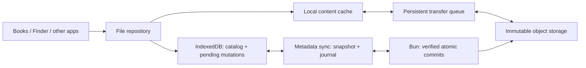

# Cloud sync: file reliability and simplification

Research date: 2026-09-21. Status: staged implementation in progress; checkpoint below.
Baseline: `c22e3d5fd` and the production Books investigation in this task.

## Implementation checkpoint — 2026-09-21

The first compatible release shipped in [PR #1915](https://github.com/ryokun6/ryos/pull/1915), main commit `6b134d0`. Production `/version.json` confirms that commit and `/health` passes. It keeps the existing wire format and storage providers.

| Increment | Implemented | Validation |
|---|---|---|
| Server safety | Atomic CAS publication of metadata, journal, blob registry and sequence; command errors propagate; remove inactivity TTLs; active book/image/document content deletion guard; GC reservations and conditional claims/marks; 30-day grace; retain all objects for accounts with dangling active file references | Server policy and recovery tests; Lua race/precondition tests on an isolated Redis 7.4.6 instance |
| Retry and ordering safety | Persist outgoing batches before sending, replay identical operations after lost responses/restart, serialize remote application, route realtime through pull, preserve pending file edits, remember deletion timestamps, prevent cursor regression, drain work when switching accounts | Restart, response-loss, pending-edit, stale-response and account-isolation tests; real local Bun API engine integration |
| Catalog and book loading | Persist independent download jobs before acknowledging catalog; two background workers with foreground opens joining or starting immediately; failed files remain queued; reload resumes jobs; per-file progress; simple reader progress bar; bundled-book progress; covers read cached/local data without fetching entire cloud books; transient cover failures retry after content arrives; re-read repaired UUIDs | 200-book catalog completes with zero EPUB body requests; missing-file, quota, checksum and retry cases; cover recovery and progress-bar rendering tests |

Validation for the shipped release: all 3,024 unit/wiring tests, four real-Redis tests, and nine local API engine tests pass. TypeScript passes; targeted ESLint reports only the two pre-existing reader fast-refresh warnings. The Redis tests are opt-in and skipped in the ordinary unit command.

Test commands:

```sh
bun test tests/unit/sync tests/unit/books tests/unit/vfs
bunx tsc --noEmit -p tsconfig.app.json
# Isolated localhost Redis, never the application's configured Redis URL:
SYNC_TEST_REDIS_PORT=16379 bun test tests/unit/sync/test-sync-atomic-redis.test.ts
# Local Bun API configured to use that disposable Redis:
API_URL=http://127.0.0.1:13000 bun test tests/integration/api/test-sync-v2-engine-e2e.test.ts
# Read-only consistency inventory for a selected account:
bun --env-file=.env.local scripts/audit-sync-files.ts <username>
```

The reader bar is determinate when transfer length is known, and indeterminate while resolving content or laying out the EPUB. It disappears when the reader is ready. A 404 remains an actionable load error; a progress bar cannot recover a deleted cloud object.

### Next increment: atomic file saves and durable replay

Implemented on `codex/cloud-sync-local-journal`, separately from the shipped release:

- IndexedDB v18 adds an account-scoped, append-only file-catalog mutation journal. File rows and immutable operations commit in the same transaction; a transient transaction failure retains the exact operation for retry. Capture occurs synchronously before the existing persistence debounce, so remote applies cannot relabel an earlier local edit.
- Startup, pull and flush replay saved operations before consuming remote metadata. Acknowledgement removes only captured IDs, preserving edits made during a request. Both accepted operations and server winners reconcile stale catalog rows before acknowledgement; the cursor still pulls intervening changes.
- File persistence merges each tab's row changes; broadcasts refresh committed rows while preserving edits made during the read. Sync's remote setters do not generate new local operations. Backup restore clears operational journals with the restored data.

The common Finder save path (also used by TextEdit, Paint, Books imports and Applet saves) now commits file metadata, content, and a paired mutation in one transaction. It publishes in-memory metadata after commit and rejects failures so editors retain their unsaved state. Saves to the same path serialize in invocation order. The shared `dbOperations.put` helper now waits for transaction completion, rather than treating request success as a committed save.

Immutable content snapshots live in a separate operational store; reading the queue does not load every EPUB. Replay reads one binary snapshot at a time, uploads bytes first, then submits content and catalog records together. EPUB serialization uses the existing codec representation so content hashes remain stable. Initial catalog pulls defer these larger uploads to the flush worker while protecting queued local changes.

Validation: 3,050 unit/wiring tests, four real-Redis atomicity tests and ten real local API engine tests pass. TypeScript passes; targeted ESLint reports one existing Finder hook dependency warning. The isolated Chrome canaries pass for renderer-crash recovery of document/EPUB bytes and paired intent, simultaneous tab saves, and rollback after a successful IndexedDB request followed by transaction abort. Run `SYNC_BROWSER_CHANNEL=chrome bun scripts/test-file-save-browser.ts` against local Vite on port 15173; the test uses a disposable browser profile and mocked local API responses.

This increment covers **catalog mutations and the common file-save/import path**. Copy/move/trash transitions still have separate content and catalog steps and need their own transaction migration. Metadata-only edits retain their existing debounce before disk commit; awaited normal file saves now finish only after their transaction commits. Chrome renderer crashes and transaction aborts are tested; OS-process loss and Safari/iOS quota/eviction behavior remain additional canaries. Thumbnails, file identity migration and recovery of existing missing bytes are separate phases.

### Remaining phases and gates

- **Complete C:** migrate copy/move/trash transitions to atomic transactions; add a single elected background-transfer worker; extend canaries to OS-process loss and Safari/iOS eviction. Catalog capture, common document/binary saves, bounded durable content replay and Chrome crash/abort checks are implemented.
- **Complete D:** synchronize thumbnails as their own small content records, and add per-file offline controls. The current change prevents thumbnail-triggered EPUB downloads but does not transfer thumbnails between devices.
- **E:** versioned stable file identity, content-only hashes/raw byte uploads, server-side upload verification, legacy-reader capability gating, builtin identity reconciliation, and multipart only where provider support and measurements justify it. Existing UUID and path formats remain readable. Do not delete either existing Meditations entry based on its title.
- **F:** verify production Redis persistence and object backups with a restore rehearsal, test the configured Upstash/Valkey backend as applicable, run an opt-in account canary and representative production benchmarks, then progressively enable schema migration. Local fake IndexedDB and Redis tests do not establish real-browser crash durability or production backup health.

No production objects or user records were repaired or removed. The six previously observed missing books still require recoverable original bytes or a surviving copy. The audit intentionally errs toward retaining storage: an active builtin item without a cloud content record also protects its account from GC until reconciled.

---

**Recommendation.** Evolve the existing Bun + Redis/Valkey + S3-compatible storage system. Retain the change journal and small-document codecs. Introduce a single file lifecycle with stable identity, immutable content, a persistent local mutation queue, and a server-verified commit. Separate catalog replication from downloading file bytes. Ship server safety and recovery work before changing the file format.

This recommendation follows a source review and official documentation research. Production logs confirmed six tombstoned book-content records with active file metadata; they did not establish which client originally issued those deletions. No new production inspection, deployment, or data repair was performed for this proposal. Performance targets below are proposed acceptance criteria, not measurements.

**Baseline findings before this implementation**

| Finding | Evidence | Consequence |
|---|---|---|
| File metadata, content, and reading state have separate identities | `src/stores/useFilesStore.ts`: path-keyed metadata and content UUID; `src/sync/codecs.ts`: `files/item:<path>`, `books/item:<uuid>`, `bookshelf/progress:<path>` | Renames, imports, defaults, and restores must keep several records aligned. |
| Bootstrap applies blobs before finishing its snapshot | `src/sync/engine.ts`: `applySnapshot`, `applyRemoteOps`, `applyBlobOps`, `initialSyncPending` | One permanently missing object can hold back completion even after the recent retry fixes. |
| Binary uploads serialize IndexedDB rows to JSON, then gzip them | `src/utils/indexedDBBackup.ts`, `src/sync/blobs.ts`, `src/sync/codecs.ts` | Base64, JSON, hashing, and compression create extra allocations. The digest includes row identity/metadata rather than only file bytes. Base64 expands the intermediate representation; gzip means this is not a claim of a fixed 33% network penalty. |
| Upload preparation compresses the full pending batch first | `src/sync/blobs.ts`: `uploadBlobItems` | Three concurrent transfers improve network utilization, but do not bound the earlier whole-library preparation cost. |
| Cover extraction can fetch and parse entire EPUBs | `src/apps/books/utils/useBookCover.ts`: `loadCover` | On a fresh device, simply displaying the shelf can trigger serial full-book reads. Thumbnails exist locally but are not a shared catalog resource. A failed read can also persist empty cover information until invalidation. |
| Server writes are a pipeline guarded by a lease | `api/sync/v2/_core.ts`: `applySyncOps`; `api/_utils/redis.ts`: `StandardRedisPipelineAdapter` | Pipeline commands are not an atomic metadata/journal/cursor transaction. The adapter also discards individual command errors by selecting only tuple result values. |
| The lock has a 10-second expiry and releases using unconditional `DEL` | `api/sync/v2/_core.ts`: `acquireUserLock`, `releaseUserLock` | An expired holder can delete a subsequent holder's lock; expiry can permit overlapping writers. |
| Blob collection uses a reference snapshot and a 24-hour grace period | `api/sync/v2/_maintenance.ts` | A mistaken deletion can become physical loss after the grace period and a later sweep. Reference changes during a sweep also need explicit coordination. |
| Sync metadata has a sliding 365-day TTL | `api/sync/v2/_core.ts`, `api/_utils/auth/_constants.ts` | Long inactivity can expire authoritative metadata. That should be an explicit retention policy, not inherited from an authentication constant. |
| “Books” means different things in code and settings | `src/shared/sync2/namespaces.ts` | EPUB bytes belong to Files; the Books category controls reading state/preferences. Status and controls can mislead users. |

The previous patch addressed swallowed download failures, premature blob acknowledgements, snapshot cursor ordering, transfer concurrency, request limits, startup retry, and active-book deletion protection. It did not establish a unified file commit protocol or recover previously deleted content.

The existing `docs/proposals/cloud-sync-v2.md` also contains stale “implemented” notes describing a LIST journal; current code uses a bounded sorted set. Refresh the architecture documentation as part of this work.

**The target model**



One generic file record should contain:

```ts
type FileRecord = {
  id: string;                  // stable across rename/move/content replacement
  parentId: string;
  name: string;
  revision: number;            // server-assigned
  contentId: string | null;    // digest of raw bytes; null for directories
  size: number;
  mimeType: string;
  deletedAt: string | null;
  builtinId?: string;          // e.g. books/meditations/<edition>
};
```

Book progress, highlights, bookmarks, and cover metadata refer to `fileId`, with content-version information where necessary. A same-name replacement EPUB may invalidate CFIs; keep its old reading state rather than silently applying incompatible positions. Migrate KOReader mappings explicitly. A rename changes a record's name/parent, not its content or reading identity.

Separate cloud state from device availability. A committed cloud file can be `not downloaded`, `downloading`, `available offline`, or `download failed` locally. A local import remains `waiting to upload` or `upload failed` until its server commit is acknowledged. “Synced” must never mean only that a shelf entry exists.

Browser storage remains evictable. Request persistence where supported and show available-space information, but retain explicit backup/export options for unsynced originals. A local queue cannot protect bytes from the user clearing site data. The browser storage model documents best-effort storage and persistence requests. [MDN storage quotas and eviction](https://developer.mozilla.org/en-US/docs/Web/API/Storage_API/Storage_quotas_and_eviction_criteria)

**1. Make commits and deletion safe first**

Replace the application-level read/lock/pipeline sequence with a small, bounded Redis Lua operation that validates expected revisions, deduplicates mutation IDs, updates records and content references, allocates journal sequence numbers, and appends change events together. Validate input/key types before mutation; atomic execution is not a promise of rollback after a script error. Test against both supported Redis adapters and their actual server versions. For clustered deployments, all involved per-account keys must share a hash slot.

Redis documents atomic script execution and warns that scripts block other work, so keep batches bounded and move hashing/storage verification outside the script. In the interim, fix token-checked lease release and propagate pipeline command errors; token checking alone does not make a lease that expires mid-write safe. [Redis Lua](https://redis.io/docs/latest/develop/programmability/eval-intro/), [Redis lock ownership](https://redis.io/docs/latest/develop/clients/patterns/distributed-locks/)

Use explicit delete mutations for files, folders, and associated durable records. Missing local bytes mean an absent cache entry. An empty or not-yet-hydrated local store must not imply cloud deletion. Preserve Trash and recent content revisions under a proposed 30-day recovery policy; decide storage cost and user-facing policy before finalizing the duration.

GC must coordinate with commits: atomically recheck references, retained revisions, and upload leases before claiming a content object for deletion. Once claimed, prevent new commits from referencing it; require a fresh upload/verification if needed. Then delete externally and finalize the claim. A reference snapshot taken at sweep start is insufficient.

Remove inactivity TTLs from authoritative file/catalog records and their required content registry. Keep retention bounds on journals and temporary upload sessions. Specify and test Redis persistence, failover, and backup recovery rather than assuming atomic writes imply durability. Production persistence configuration has not been verified here. [Redis persistence](https://redis.io/docs/latest/operate/oss_and_stack/management/persistence/)

**2. Add a durable queue for file mutations**

Store each create, rename, content replacement, and deletion with a stable `mutationId`, account ID, file ID, expected revision, content ID, and retry state. Write the local metadata mutation and queue entry in the same IndexedDB transaction. Keep pending local edits as an overlay while applying remote catalog updates; bootstrap must not overwrite an unsent local change.

Retry the same mutation ID after a timeout or lost acknowledgement. Record server results so retries return the same outcome without another version or duplicate default. Coalesce unsent intermediate edits only when dependencies and deletion intent remain correct. Start with file mutations; keep shadow-based syncing for small settings until there is a demonstrated need to replace it.

Use one serialized metadata apply loop for snapshots, journal pages, and realtime-triggered pulls. Commit catalog changes, required download jobs, and the cursor together. Realtime should signal that newer changes exist; route it through the same correctness path. Keep wake/reconnect checks as catch-up triggers. Multiple tabs should share a queue with an elected worker/lease, while server idempotency remains the correctness guarantee.

IndexedDB provides transactions across object stores in one database, which fits catalog + outbox + cursor updates. Network operations must happen outside the transaction. Scope durable jobs/cache lookups to the account, and explicitly handle guest-to-account import and account switching. [IndexedDB specification](https://www.w3.org/TR/IndexedDB/)

**3. Upload bytes, verify them, then publish the file**

The file upload lifecycle should be:

1. Save the local file and mutation; compute a raw-byte digest once per content revision using a worker and bounded buffers.
2. Prepare an account-scoped upload session, or obtain a verified existing content record for that account.
3. Transfer bytes directly to the current S3-compatible provider. Keep the authenticated proxy as a fallback.
4. Complete and verify object existence, size, and an actual storage-validated checksum.
5. Atomically commit the file record, content reference, and change event. Only then acknowledge cloud availability.

Object storage and Redis do not share a transaction. Upload sessions bridge that boundary: interrupted uploads are uncommitted objects eligible for later cleanup; active file records only reference verified, committed objects. Protect pending sessions from GC. A client-provided hash stored as object metadata is not proof of file integrity, and multipart ETags are not universal file hashes. If the actual provider cannot validate/expose the required checksum, stream and verify through a controlled server path. [S3 integrity verification](https://docs.aws.amazon.com/AmazonS3/latest/userguide/checking-object-integrity-upload.html)

Keep single PUT for small files. Add S3 multipart resumption for larger files or costly transfers after a provider capability test; persist upload IDs and completed parts. Choose the threshold from measured retry cost, not an arbitrary universal file size. Clean up abandoned multipart sessions. S3 supports independent part retries, which is directly relevant to interrupted first uploads. [S3 multipart uploads](https://docs.aws.amazon.com/AmazonS3/latest/userguide/mpuoverview.html)

I would choose S3 multipart over adding a tus server because the project already uses S3 upload instructions. tus remains a reasonable alternative if provider-independent resumable HTTP becomes a requirement; its offset/checksum protocol is established, but introduces another service/protocol to operate here. [tus specification](https://tus.io/protocols/resumable-upload)

Deduplicate physical content within an account by raw digest. Keep two intentionally imported documents as distinct logical files if the user wants both. Rename should upload zero file bytes. Compression becomes an optional transport optimization for suitable formats, not the storage identity. Preserve legacy gzip-envelope readers during migration.

**4. Make first sync usable immediately**

Replicate small catalog records first, then schedule independent content jobs. A failed EPUB download should not prevent settings, reading progress, or unrelated files from converging. Advancing the metadata cursor is safe only after required transfer work is durably recorded; it must not depend on volatile in-memory download promises.

Prioritize the opened file, then files pinned for offline use, then thumbnails, then optional prefetch. Retain three transfers as an initial default, with separate CPU/memory budgets. Bound hashing, compression, and byte buffering too. Retry transient network/5xx/429 failures with jitter and Retry-After support; refresh expired signing instructions. Treat missing objects, invalid content, quota failures, and expired authentication as distinct states with appropriate recovery actions.

Store EPUB title, author, and a small cover thumbnail as derived catalog resources keyed by content version. Extract once on import, or as a background repair when actual bytes are available. A shelf listing must not require downloading every EPUB. Do not persist a transient fetch failure as a permanent “no cover” result; invalidate it when content becomes available.

Provide “Keep downloaded,” “Download all,” and per-item retry. Preserve current users' established offline expectations during rollout rather than silently converting downloaded libraries into evictable placeholders. A proposed setting structure is “Files and books” for content/library sync and “Reading progress” for Books state. Show separate catalog and download status instead of one misleading percentage.

For large catalogs, paginate a consistent snapshot with a snapshot token/watermark; do not page a mutable hash and assume the pages form one point-in-time view. Retain journal coverage for the snapshot duration or require a safe restart. Introduce a sync epoch for restoration/reset and stale-device detection. An old device must reconcile pending edits before writing after its epoch or deletion-history coverage expires.

**5. Give file conflicts explicit semantics**

| Operation | Proposed behavior |
|---|---|
| Small preference change | Continue per-key LWW. |
| Rename/move | Stable ID plus expected revision; resolve name collisions visibly. |
| Concurrent content edits | Preserve both revisions; show a conflict copy or recovery action. Do not silently discard a document. |
| Delete versus edit | Return a conflict on a stale base revision and preserve the edited version for recovery. |
| Reading position | Keep the latest valid reading event; never use maximum percentage, since moving backward is legitimate. |
| Bundled book | Stable `builtinId` plus edition/content fingerprint; synchronize seed dismissal so it is not recreated. |
| Same displayed book title | Never assume identical content. Offer deduplication only with identity/content evidence. |

This avoids importing a general CRDT framework for opaque EPUBs and images. Collaborative text editing can be evaluated separately if it becomes a product requirement.

**Delivery sequence and gates**

| Phase | Changes | Required gate |
|---|---|---|
| A — Audit and protect | Inventory active files with absent/tombstoned content; retain suspected recovery candidates; fix lock ownership/pipeline errors; define backup and retention policy | Known inconsistency report; restore rehearsal; no physical deletion of protected recovery candidates |
| B — Atomic server writes | Bounded atomic metadata/journal commit, explicit deletion contract, content reference coordination, GC claims | Concurrent-writer, lease-expiry, partial-command, and GC/commit race tests on real supported backends |
| C — Durable file queue | Atomic local mutations/outbox, idempotent commit results, one metadata apply path, pending-edit overlays | Kill/reload at every boundary; pending work resumes without duplicates or lost edits |
| D — Catalog-first bootstrap | Durable download jobs, per-item availability, synced thumbnails, priority/offline controls | Shelf usable without full EPUB downloads; one broken file does not stall metadata sync |
| E — Stable identity and raw content | Versioned file schema, legacy identity mapping, builtin IDs, verified uploads; multipart where justified | Rename transfers zero content bytes; reading state survives moves; old and new readers interoperate safely |
| F — Rollout and removal | Opt-in account canary, consistency comparisons, progressive enablement, remove deprecated writers and repair branches | Recovery drill, representative library benchmarks, then retirement of legacy paths |

Each phase should be reviewable as a small set of PRs. Do A and B first. Prototype the local atomic queue before distributing lifecycle responsibilities among more hooks.

The migration must have one canonical writer per migrated account/file. Dual-read is acceptable; uncontrolled dual-write is not. Negotiate client capabilities and block incompatible legacy writes once an account crosses the schema boundary. Retain legacy path/UUID-to-file-ID mappings for progress, documents, and KOReader bridges. Do not reupload an entire existing library just to change its representation: retain a legacy content descriptor until a verified background conversion or genuine content edit.

For Meditations specifically, reconcile the canonical and short filenames using builtin identity and verified content. Preserve both reading states and annotations until the surviving identity is resolved. Do not silently delete one entry based only on its displayed title.

Rollback can disable new transfers/writers while continuing to read committed new-format files. Retain recovery manifests and old objects for the chosen retention period. Never implement rollback by running old writers against an incompatible migrated schema.

**Tests, measurements, and success criteria**

- Fault injection: tab closes after upload but before commit; lost commit response; duplicated requests; interrupted body transfer; expired signed URL; IndexedDB quota/eviction; account switch; two tabs; two offline devices; rename/edit/delete conflicts; snapshot pagination while writes continue; cursor expiry; Redis restart/failover; and GC re-reference races.
- Reconciliation invariant: every active committed file points to a verified retained content object, or an explicitly reported pre-existing broken reference. A local import cannot be called synced before that invariant holds.
- Recovery invariant: replaying a mutation produces one result; a missing cache creates zero delete mutations; all acknowledged retained revisions can be restored in the recovery drill. State the infrastructure recovery-point objective separately from application-level correctness.
- Proposed benchmark: 1,000 metadata entries and 100 mixed-size EPUBs/images, cold and warm cache, desktop and mobile browser profiles, with a controlled 20 Mbps / 100 ms RTT network. Record baseline before setting a release threshold. An initial catalog target is p95 under 3 seconds; opening a book should incur only that book's transfer/validation plus bounded scheduling overhead. These are targets, not current measurements.
- Track time to usable shelf, time to first readable book, oldest pending mutation, downloaded/reuploaded bytes, retry causes, queue depth, mismatch counts, and peak preparation memory. Include mutation/file IDs and error stages without logging file contents or signed URLs.
- Complexity gate: the file repository owns repair and availability; apps do not query sync snapshots. Remove file deletion inference, duplicated default-book fallbacks, redundant orchestration paths, and old gzip writing after their replacements are proven. Splitting the existing engine into files without removing responsibilities is not sufficient.

**Infrastructure decisions to keep bounded**

Keep Redis/Valkey initially because the journal and codecs are useful and both deployment adapters already exist. This requires explicit durable persistence/backups and a bounded atomic write implementation. If the required restore guarantees or growing relational/file-history requirements cannot be met economically with that setup, move authoritative manifests/revisions to PostgreSQL behind the same commit interface; do not make a database migration a prerequisite for the immediate fixes.

Evaluate object versioning on the actual S3-compatible provider and record costs/lifecycle behavior before enabling it. AWS S3 versioning provides an additional recovery layer, but provider support is unverified and object versions do not restore lost catalog mappings by themselves. Back up metadata and object references together. [S3 versioning](https://docs.aws.amazon.com/AmazonS3/latest/userguide/Versioning.html)

For the six already broken books, a separate read-only recovery audit should check retained journal entries, blob registry objects, storage versions, and backups before requesting reimport. The journal is bounded to 4,096 ops and GC may have removed candidates, so availability cannot be assumed. Restore found bytes through a new explicit commit and preserve the book's logical identity and progress.

**Shared file rollout — September 21, 2026**

The shared VFS save transaction and durable content journal cover documents,
images, applets, and EPUBs. Catalog-first downloads and local availability also
live in shared sync infrastructure. The Books reader uses that infrastructure
for its loading progress bar.

The next incremental change isolates preparation/upload failures during durable
file replay. Independent queued files and ordinary settings can finish in the
same flush; the failed file, its immutable bytes, and subsequent dependent
catalog edits remain queued. Dependencies follow both catalog paths and content
UUIDs so a rename cannot publish a reference before its upload succeeds. Retry
retains the original timestamps across restart. The pass still reports failure
and uses the existing retry backoff. Commit/acknowledgement failures and aborts
stop the pass because their outcome cannot safely be treated as an independent
preparation failure.

Remaining shared work: atomic move/rename/trash/restore transactions (including
directory descendants and cross-store moves), failure isolation for legacy
unjournaled uploads, per-file upload retry scheduling, stable identities and
verified raw-content uploads. Existing missing content recovery and bundled-book
deduplication remain separate from these shared reliability improvements.
